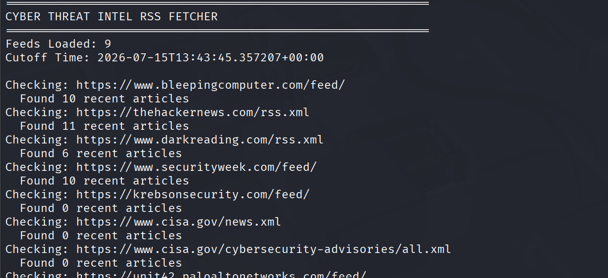
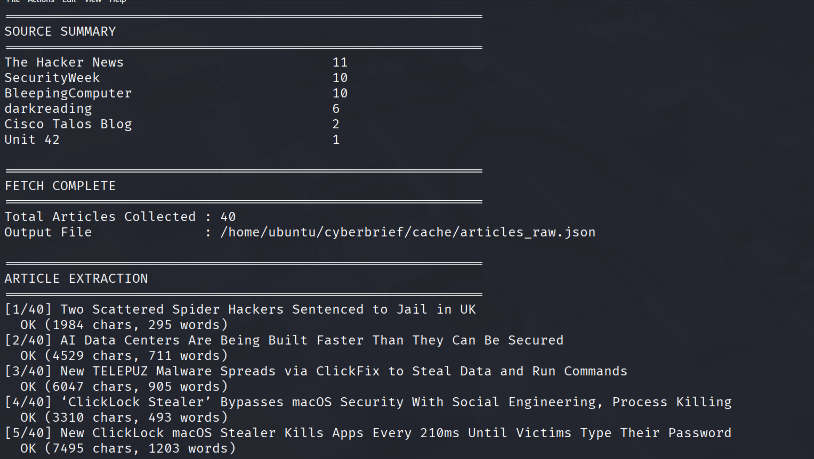
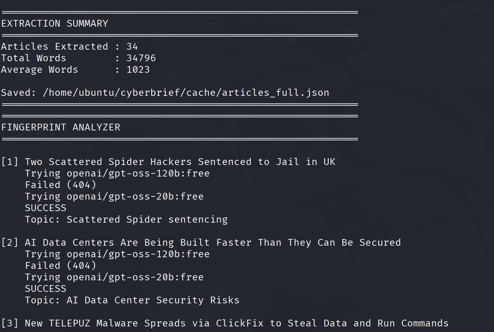
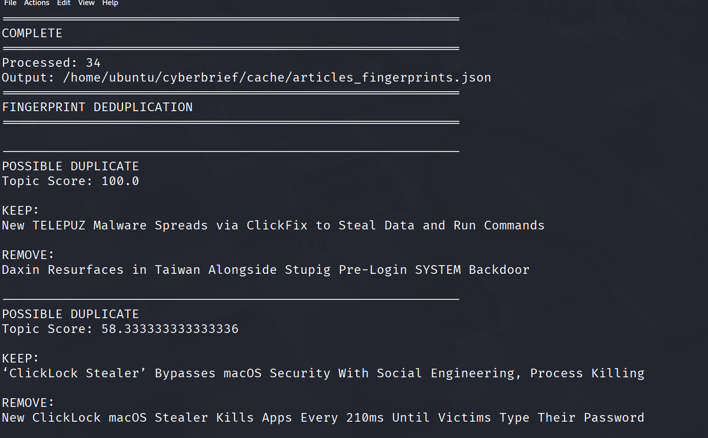
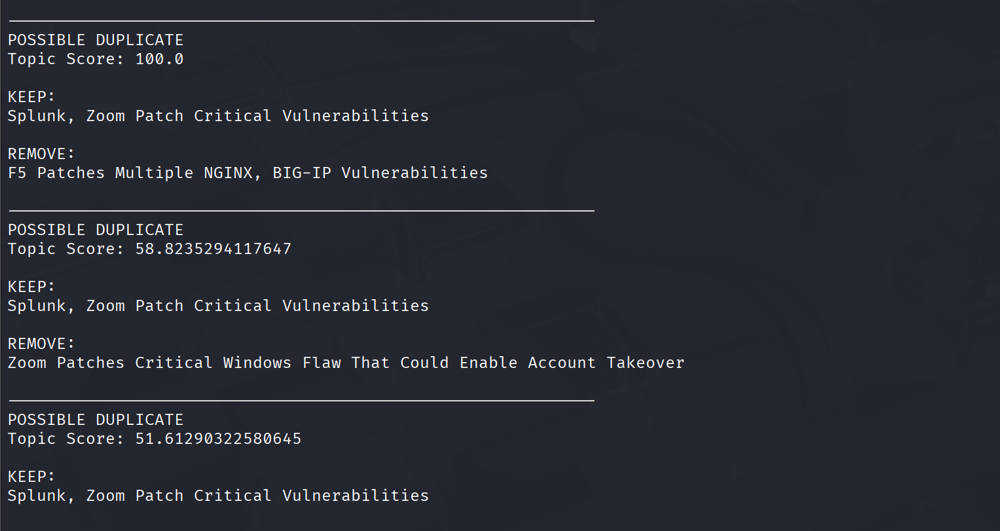
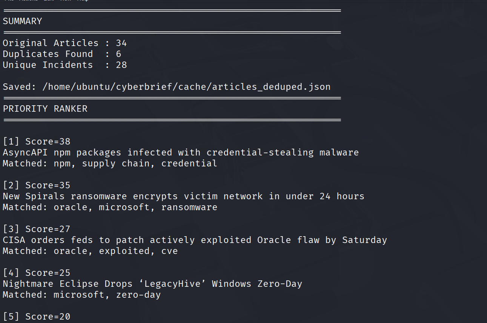
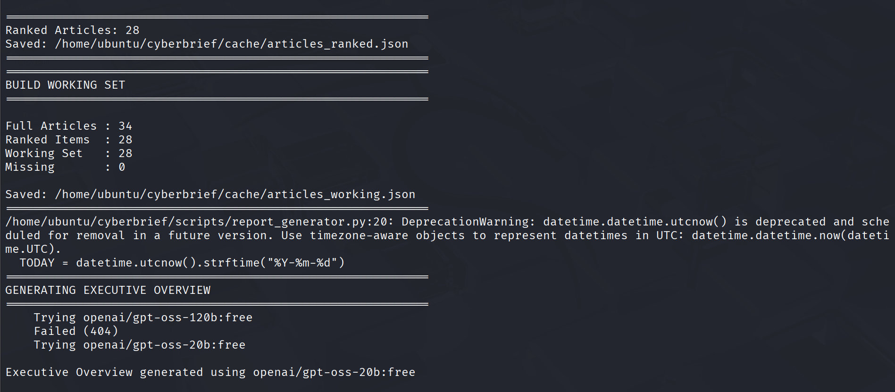
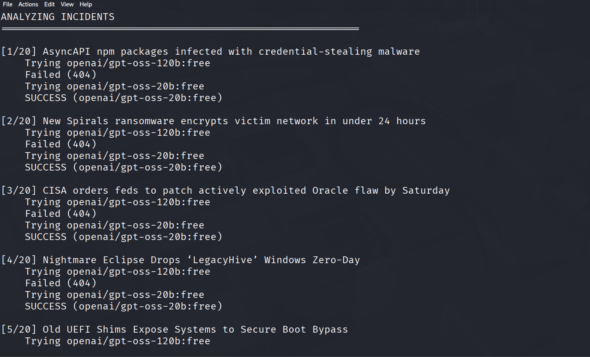
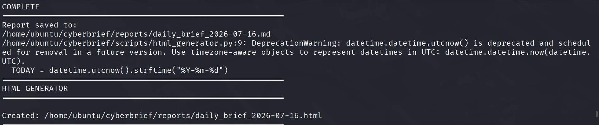

# Daily Cybersecurity Brief V2

***

## Goal
I have made versions of a daily cybersecurity brief using local AI to create a Briefs Report, however with no GPU on my VM, this took 3 hours. I decided to rework this and utilize OpenRouter.ai. I want to test it with OpenRouter's free LLMs, then eventually move to paid models. OpenRouter allows me to only need one API Key and have access to hundreds of models, including some free ones. The difference is theirs are run from the cloud making it much faster than me running it locally. You occassionally run into queue times and such, but you can set it to move through a list of models if one is not able. 

## OpenRouter
Go to https://openrouter.ai and sign up and setup an API Key. You can have multiple API Keys for different projects. You can also set a credit limit if you are using paid models. For this tutorial I will be using some of their free models that I found to be working each time I ran them and gave me good output. 

## Folder Structure
```
~/cyberbrief
│
├── cache/
│   ├── articles_raw.json
│   ├── articles_full.json
│   ├── articles_fingerprints.json
│   ├── articles_deduped.json
│   ├── articles_ranked.json
│   └── articles_working.json
│
├── feeds/
│   └── feeds.txt
│
├── reports/
│   ├── daily_brief_2026-06-22.md
│   └── daily_brief_2026-06-22.html
│
├── scripts/
│   ├── fetcher.py
│   ├── extractor.py
│   ├── fingerprint_analyzer.py
│   ├── dedupe_fingerprints.py
│   ├── priority_ranker.py
│   ├── build_working_set.py
│   ├── report_generator.py
│   └── html_generator.py
│
├── logs/
│   └── daily_brief.log
│
├── .env
├── config.py
├── run_brief.sh
└── venv/
```
Some of the files will be created there automatically through the script usage. 

## Python virtual environment
Inside the main cyberbrief folder run:
```
python3 -m venv venv
source venv/bin/activate
```

## Requirements
You can either make a requirements.txt file or just install these libraries.
```
pip install feedparser
pip install newspaper3k
pip install lxml_html_clean
pip install requests
pip install python-dotenv
pip install rapidfuzz
pip install markdown
```

## Environment Variables
Open your .env file and put this:
```
OPENROUTER_API_KEY=sk-or-v1-xxxxxxxxxxxxxxxx
```
Put your actual OpenRouter API Key in there.

## Config.py
Edit your config.py file and put:
```
OPENROUTER_URL = "https://openrouter.ai/api/v1/chat/completions"

MODELS = [
    "openai/gpt-oss-120b:free",
    "openai/gpt-oss-20b:free",
    "meta-llama/llama-3.3-70b-instruct:free",
    "qwen/qwen3-next-80b-a3b-instruct:free"
]
```
These are the free models I found to be working well. It mainly used the openai/gpt-oss ones. 

## Feeds
Edit your feeds.txt file:
```
https://www.bleepingcomputer.com/feed/
https://thehackernews.com/rss.xml
https://www.darkreading.com/rss.xml
https://www.securityweek.com/feed/
https://krebsonsecurity.com/feed/
https://www.cisa.gov/news.xml
https://www.cisa.gov/cybersecurity-advisories/all.xml
https://unit42.paloaltonetworks.com/feed/
https://blog.talosintelligence.com/rss/
```
Put whatever cybersecurity feeds you want, I just started with this small list.

## What will the different scripts do?
Before going into the various scripts, let's briefly talk about what each one will be doing:
### fetcher.py
Its purpose is:
1. Read RSS feeds
2. Only keep last 24 hours
3. Normalize metadata
4. Save articles_raw.json

Example output would be:
```
{
  "source": "BleepingComputer",
  "title": "...",
  "url": "...",
  "published": "..."
}
```

### extractor.py
Its purpose is:
1. Download article body
2. Extract text
3. Calculate word count
4. Create content hash

Example output is:
```
{
  "title": "...",
  "content": "...",
  "word_count": 742,
  "content_hash": "..."
}
```

### fingerprint_analyzer.py
Its purpose is to use OpenRouter AI to generate fingerprints. If you prompt this:
```
{
  "topic": "",
  "article_type": "",
  "vendors": [],
  "products": [],
  "cves": [],
  "malware": [],
  "threat_actors": []
}
```
It would output something like:
```
{
  "topic": "Mastra npm supply chain compromise",
  "article_type": "Supply Chain",
  "vendors": ["Mastra"],
  "cves": [],
  "malware": [],
  "threat_actors": []
}
```

### dedupe_fingerprints.py
Its purpose is to compare AI-generated topics. For example, if we see two sources show:
```
Microsoft Confirms RoguePlanet Defender Zero-Day

Microsoft Working on Patch for RoguePlanet Zero-Day
```
It will be detected as 98% similar. It will keep one then remove the duplicates. Later versions, I could add a function to rank which source I would rather keep. 

### priority_ranker.py
It's purpose is to score incidents based on your interests. If you work in the healthcare industry, you would be more interested in healthcare-related articles. Some example keywords:
```
PRIORITY_KEYWORDS = {
    "oracle": 10,
    "npm": 10,
    "supply chain": 10,
    "zero-day": 10,
    "ransomware": 8,
    "fortinet": 8,
    "credential": 8,
    "cve": 5
}
```
Plus Article Type Scoring:
```
ARTICLE_TYPE_SCORES = {
    "Supply Chain": 10,
    "Ransomware": 10,
    "Malware": 9,
    "Vulnerability": 8,
    "Patch": 4,
    "Advisory": 1
}
```
It will output a file called articles_ranked.json

### build_working_set.py
It's purpose is to merge articles_full.json and articles_ranked.json, so that it produces a master working set called articles_working.json. This would output something like:
```
{
  "content": "...",
  "fingerprint": {},
  "priority_score": 30,
  "url": "...",
  "title": "..."
}
```
Which is now our working primary dataset.

### report_generator.py
It's purpose is to generate the CTI Brief. It will process whatever you put in:
```
TOP_N = 10
```
That variable would process the top ten. You can change this value to 20 to get the top 20. This will generate an Executive Summary with things like:
1. Threat landscape
2. Key trends
3. Priority actions
4. Risk distribution

It will also have an Incident Analysis with things like:
1. Executive Summary
2. Technical Summary
3. Risk Level
4. Key Findings
5. CVEs
6. IOCs
7. Recommendations

It will output in Markdown as reports/daily_brief_YYYY-MM-DD.md

### html_generator.py
It's purpose is to convert the Markdown report to an HTML report. No AI required for this. 

### run_brief.sh
This will be the script you want to setup to either be run on an automated schedule or run it manually whenever you need.
``` 
#!/bin/bash

cd /home/sh1katagana1/cyberbrief

source venv/bin/activate

python3 scripts/fetcher.py
python3 scripts/extractor.py
python3 scripts/fingerprint_analyzer.py
python3 scripts/dedupe_fingerprints.py
python3 scripts/priority_ranker.py
python3 scripts/build_working_set.py
python3 scripts/report_generator.py
python3 scripts/html_generator.py

deactivate
```
You can see it runs each script sequentially. Make sure you make it executable:
```
chmod +x run_brief.sh
```

### Scheduling
If you want to schedule it to run at a certain time each day:
```
crontab -e
```
At the bottom put this line, replacing the path with your own computer path:
```
0 6 * * * /home/sh1katagana1/cyberbrief/run_brief.sh >> /home/sh1katagana1/cyberbrief/logs/daily_brief.log 2>&1
```
That one runs every day at 6:00 AM (assuming VM timezone is Central).

## Scripts
Here is fetcher.py
```
#!/usr/bin/env python3

import feedparser
import json
from datetime import datetime, timedelta, timezone
from pathlib import Path

BASE_DIR = Path(__file__).resolve().parent.parent

FEED_FILE = BASE_DIR / "feeds" / "feeds.txt"
CACHE_DIR = BASE_DIR / "cache"
OUTPUT_FILE = CACHE_DIR / "articles_raw.json"

CACHE_DIR.mkdir(exist_ok=True)

articles = []

# Only collect articles from last 24 hours
cutoff = datetime.now(timezone.utc) - timedelta(hours=24)

# Read RSS feed list
with open(FEED_FILE, "r") as f:
    feeds = [line.strip() for line in f if line.strip()]

print("=" * 60)
print("CYBER THREAT INTEL RSS FETCHER")
print("=" * 60)
print(f"Feeds Loaded: {len(feeds)}")
print(f"Cutoff Time: {cutoff.isoformat()}")
print()

for feed_url in feeds:

    print(f"Checking: {feed_url}")

    try:
        feed = feedparser.parse(feed_url)

        feed_title = feed.feed.get("title", feed_url)

        feed_count = 0

        for entry in feed.entries:

            if not hasattr(entry, "published_parsed"):
                continue

            try:
                published = datetime(
                    *entry.published_parsed[:6],
                    tzinfo=timezone.utc
                )
            except Exception:
                continue

            if published < cutoff:
                continue

            article = {
                "source": feed_title,
                "title": entry.get("title", "").strip(),
                "url": entry.get("link", "").strip(),
                "published": published.isoformat()
            }

            articles.append(article)
            feed_count += 1

        print(f"  Found {feed_count} recent articles")

    except Exception as e:
        print(f"  ERROR: {e}")

# Sort newest first
articles.sort(
    key=lambda x: x["published"],
    reverse=True
)

# Save output
with open(OUTPUT_FILE, "w") as f:
    json.dump(articles, f, indent=2)

# Build source statistics
source_counts = {}

for article in articles:
    source = article["source"]
    source_counts[source] = source_counts.get(source, 0) + 1

print()
print("=" * 60)
print("SOURCE SUMMARY")
print("=" * 60)

for source, count in sorted(
    source_counts.items(),
    key=lambda x: x[1],
    reverse=True
):
    print(f"{source:<40} {count}")

print()
print("=" * 60)
print("FETCH COMPLETE")
print("=" * 60)
print(f"Total Articles Collected : {len(articles)}")
print(f"Output File              : {OUTPUT_FILE}")
print()

```
Let's breakdown the script:
### Imports
```
import feedparser
import json
from datetime import datetime, timedelta, timezone
from pathlib import Path
```
Imports are like loading tools into your toolbox.
1. feedparser - This is used to read RSS feeds. For example if you have:
```
<item>
  <title>New Fortinet Vulnerability</title>
  <link>https://...</link>
</item>
```
Feedparser will convert that XML into Python objects.
2. json - Used to save data as JSON.
3. datetime - Used for time calculations. For example, to get the current time you do:
```
now = datetime.now()
```
4. Path - Used to work with files and folders.

### Directory Variables
```
BASE_DIR = Path(__file__).resolve().parent.parent
```
What is file? Suppose /home/sh1katagana1/cyberbrief/scripts/fetcher.py is running. Then:
```
__file__
```
equals:
```
/home/sh1katagana1/cyberbrief/scripts/fetcher.py
```
Then we see resolve()
```
Path(__file__).resolve()
```
This converts it to a full absolute path. Then we see 'parent'
```
.parent
```
moves up one directory:
```
/home/sh1katagana1/cyberbrief/scripts
```
Then we see parent.parent. This moves up again:
```
/home/sh1katagana1/cyberbrief
```
So:
```
BASE_DIR
```
becomes:
```
/home/sh1katagana1/cyberbrief
```
regardless of where the script is launched from.

### File Locations
```
FEED_FILE = BASE_DIR / "feeds" / "feeds.txt"
CACHE_DIR = BASE_DIR / "cache"
OUTPUT_FILE = CACHE_DIR / "articles_raw.json"
```
This creates paths like: /home/sh1katagana1/cyberbrief/feeds/feeds.txt and /home/sh1katagana1/cyberbrief/cache/articles_raw.json

### Create Cache Directory
```
CACHE_DIR.mkdir(exist_ok=True)
```
This means: create cache folder if missing but Don't crash if it already exists.

### Create Empty List
```
articles = []
```
Think of this as an empty bucket. Every article we find gets dropped into this bucket. Example later in the script:
```
articles.append(article)
```
adds one article to this list, hence the word 'append'.

### Last 24 Hours Filter
```
cutoff = datetime.now(timezone.utc) - timedelta(hours=24)
```
Suppose current time is: 2026-06-22 18:00 UTC. Then:
```
cutoff
```
becomes:
```
2026-06-21 18:00 UTC
```
Any article older than that is ignored. This is how you keep the report focused on today's news.

### Load RSS Feed List
```
with open(FEED_FILE, "r") as f:
```
This opens feeds.txt as read and assigns to a variable called 'f'. If you recall our feeds.txt file looked like:
```
https://www.bleepingcomputer.com/feed/
https://thehackernews.com/rss.xml
```
This code:
```
feeds = [line.strip() for line in f if line.strip()]
```
1. Reads each line
2. Removes spaces/newlines
3. Ignores blank lines

The final result would be something like:
```
feeds = [
    "https://www.bleepingcomputer.com/feed/",
    "https://thehackernews.com/rss.xml"
]
```

### Process Each Feed
```
for feed_url in feeds:
```
This says to loop through every RSS feed. Example:
```
Feed 1
Feed 2
Feed 3
```

### Download RSS Feed
```
feed = feedparser.parse(feed_url)
```
As an example, it will download https://www.bleepingcomputer.com/feed/ and parse it. Now feed.entries has articles in it. 

### Feed Title
```
feed_title = feed.feed.get("title", feed_url)
```
So instead of https://www.bleepingcomputer.com/feed/, it would be Bleeping Computer, because if you browse to that URL, you see:
```
<channel>
<title>BleepingComputer</title>
<link>https://www.bleepingcomputer.com/</link>
<description>BleepingComputer - All Stories</description>
```
We are just pulling the Title section.

### Process Articles
```
for entry in feed.entries:
```
Loop through every article in that feed.

### Published Date Check
```
if not hasattr(entry, "published_parsed"):
    continue
```
Some feeds don't include dates. If missing, then skip the article. This is a function in the feedparser library https://feedparser.readthedocs.io/en/latest/reference-feed-published_parsed/

### Convert Feed Date
```
published = datetime(
    *entry.published_parsed[:6],
    tzinfo=timezone.utc
)
```
This would convert Sun, 22 Jun 2026 into datetime(...), which Python can compare.

### Ignore Old Articles
```
if published < cutoff:
    continue
```
As an example:
```
Article age = 3 days
```
Skip it. Only last 24 hours survive.

### Create Article Object
```
article = {
    "source": feed_title,
    "title": entry.get("title", "").strip(),
    "url": entry.get("link", "").strip(),
    "published": published.isoformat()
}
```
That creates:
```
{
  "source": "BleepingComputer",
  "title": "New Vulnerability",
  "url": "https://...",
  "published": "2026-06-22T18:00:00+00:00"
}
```
This is our normalized article format.

### Store Article
```
articles.append(article)
```
This adds article to the articles bucket.

### Sort Newest First
```
articles.sort(
    key=lambda x: x["published"],
    reverse=True
)
```
This sorts the newest to the oldest. 

### Save JSON
```
with open(OUTPUT_FILE, "w") as f:
```
This creates:
```
cache/articles_raw.json
```
Then it writes the articles in:
```
json.dump(articles, f, indent=2)
```
Which produces something like:
```
[
  {
    "source": "BleepingComputer",
    "title": "...",
    "url": "..."
  }
]
```

### Build Statistics
```
source_counts = {}
```
This creates a dictionary. As an example:
```
{
  "BleepingComputer": 8,
  "The Hacker News": 8,
  "SecurityWeek": 10
}
```

### Count Sources
```
for article in articles:
```
This loops through every article and counts how many came from each source.

### Print Summary
```
SecurityWeek          10
BleepingComputer       8
The Hacker News        8
```
This is purely for your visibility.

### Final Statistics
```
Total Articles Collected : 29
Output File              : articles_raw.json
```
so you know the script worked.

***

Let's move on to the extractor.py script:
```
#!/usr/bin/env python3

import json
import hashlib
from pathlib import Path
from newspaper import Article

BASE_DIR = Path(__file__).resolve().parent.parent

INPUT_FILE = BASE_DIR / "cache" / "articles_raw.json"
OUTPUT_FILE = BASE_DIR / "cache" / "articles_full.json"

with open(INPUT_FILE, "r") as f:
    articles = json.load(f)

results = []

print("=" * 60)
print("ARTICLE EXTRACTION")
print("=" * 60)

for idx, article in enumerate(articles, start=1):

    title = article["title"]
    url = article["url"]

    print(f"[{idx}/{len(articles)}] {title}")

    try:

        news = Article(url)

        news.download()
        news.parse()

        text = news.text.strip()

        if len(text) < 500:
            print("  SKIPPED (too little content)")
            continue

        content_hash = hashlib.sha256(
            text[:5000].encode("utf-8")
        ).hexdigest()

        results.append({
            "source": article["source"],
            "title": title,
            "url": url,
            "published": article["published"],
            "word_count": len(text.split()),
            "content_hash": content_hash,
            "content": text
        })

        print(
            f"  OK ({len(text)} chars, "
            f"{len(text.split())} words)"
        )

    except Exception as e:

        print(f"  ERROR: {e}")

print()
print("=" * 60)
print("EXTRACTION SUMMARY")
print("=" * 60)

total_words = sum(
    article["word_count"]
    for article in results
)

avg_words = (
    round(total_words / len(results))
    if results
    else 0
)

print(f"Articles Extracted : {len(results)}")
print(f"Total Words        : {total_words}")
print(f"Average Words      : {avg_words}")

with open(OUTPUT_FILE, "w") as f:
    json.dump(results, f, indent=2)

print()
print(f"Saved: {OUTPUT_FILE}")
print("=" * 60)

```
Let's break this script down:

### Imports
```
import json
import hashlib
from pathlib import Path
from newspaper import Article
```
These are the libraries we need.

1. json - Used to read and write JSON files. 
2. hashlib - Used to create a unique fingerprint, which is useful later for detecting duplicates.. As an example:
```
"Fortinet vulnerability"
```
Becomes:
```
a92c1c93f2f...
```
3. Path - Used to build file paths safely. Same thing we used in fetcher.py
4. Article - Instead of downloading messy HTML, it gives us the actual article. The Newspaper3k library can:
* Visit a webpage
* Extract article text
* Remove menus
* Remove ads
* Remove navigation bars


### Find Project Folder
```
BASE_DIR = Path(__file__).resolve().parent.parent
```
Suppose you have /home/sh1katagana1/cyberbrief/scripts/extractor.py. Then:
```
BASE_DIR
```
becomes:
```
/home/sh1katagana1/cyberbrief
```
This lets the script find your files no matter where it runs from.


### Input and Output Files
```
INPUT_FILE = BASE_DIR / "cache" / "articles_raw.json"
OUTPUT_FILE = BASE_DIR / "cache" / "articles_full.json"
```
Here you have Input: articles_raw.json created by: fetcher.py. The output would be articles_full.json created by extractor.py


### Load Articles
```
with open(INPUT_FILE, "r") as f:
    articles = json.load(f)
```
Reads:
```
[
  {
    "title": "...",
    "url": "..."
  }
]
```
into memory. So now: 'articles' contains all the articles found by the RSS fetcher.


### Empty Results List
```
results = []
```
Think of this as an empty bucket. Every successfully extracted article goes into this bucket.

### Loop Through Articles
```
for idx, article in enumerate(articles, start=1):
```
As an example:
```
Article 1
Article 2
Article 3
```
enumerate() gives:
```
idx = 1
idx = 2
idx = 3
```
so we can print progress.

### Extract Basic Info
```
title = article["title"]
url = article["url"]
```
Suppose we have:
```
{
  "title": "Fortinet Vulnerability",
  "url": "https://..."
}
```
Then the title becomes:
```
Fortinet Vulnerability
```
and the url becomes:
```
https://...
```

### Create Article Object
```
news = Article(url)
```
This creates a Newspaper object. Think of it as: "Prepare to visit webpage"

### Download Page
```
news.download()
```
This actually fetches https://... from the internet.

### Parse Page
```
news.parse()
```
This is where Newspaper does its magic. It removes:
1. menus
2. ads
3. headers
4. footers
5. comments

and extracts just the article text.

### Get Clean Text
```
text = news.text.strip()
```
Let's say you had an article body of:
```
Fortinet has released patches for...
```
Now the 'text' variable contains only the article body.

### Ignore Tiny Articles
```
if len(text) < 500:
```
Some pages contain:
1. Login required
2. Article moved
3. Short notice
4. Advertisement

instead of real content. If less than 500 characters, we skip it.

### Create Content Hash
```
content_hash = hashlib.sha256(
    text[:5000].encode("utf-8")
).hexdigest()
```
This creates a unique fingerprint. For example:
```
Fortinet article
```
might become:
```
9ac34e7f8f...
```
Why? Later we can detect:
1. same article
2. same content
3. duplicate stories

without reading the whole thing again.

### Calculate Word Count
```
len(text.split())
```
For example:
```
742 words
```
This is useful for:
1. reporting
2. statistics
3. quality checks

### Build Final Article Record
```
results.append({
```
This creates:
```
{
  "source": "...",
  "title": "...",
  "url": "...",
  "published": "...",
  "word_count": 742,
  "content_hash": "...",
  "content": "Full article text"
}
```
This is much richer than the RSS feed data.

### Success Message
```
print(
    f"  OK ({len(text)} chars, "
    f"{len(text.split())} words)"
)
```
Example output may be:
```
OK (5425 chars, 794 words)
```
So you know extraction worked.

### Error Handling
```
except Exception as e:
```
If there is an error, store that error message in the 'e' variable. Sometimes these error messages are not very clear to basic users, so we can put our own message in explaining it better than insert the actual error message as well using the 'e' variable. As an example, if we get:
```
Cloudflare
404
Timeout
```
we don't crash. Instead:
```
ERROR: ...
```
and continue. This is how your pipeline survives bad websites.

### Calculate Statistics
```
total_words = sum(
    article["word_count"]
    for article in results
)
```
This adds up:
```
742
532
815
621
```
into:
```
13092
```
and that gives us total words extracted.

### Average Article Length
```
avg_words = (
    round(total_words / len(results))
```
As an example:
```
13092 words
÷
23 articles
=
569 average words
```

### Save Output
```
with open(OUTPUT_FILE, "w") as f:
```
This creates:
```
cache/articles_full.json
```

### Write JSON
```
json.dump(results, f, indent=2)
```
Saves all extracted articles. This becomes the input for fingerprint_analyzer.py

***

Now we move into fingerprint_analyzer.py
```
#!/usr/bin/env python3

import json
import os
import sys
import time
import requests

from pathlib import Path
from dotenv import load_dotenv

BASE_DIR = Path(__file__).resolve().parent.parent
sys.path.append(str(BASE_DIR))

from config import MODELS, OPENROUTER_URL

INPUT_FILE = BASE_DIR / "cache" / "articles_full.json"
OUTPUT_FILE = BASE_DIR / "cache" / "articles_fingerprints.json"

load_dotenv(BASE_DIR / ".env")

API_KEY = os.getenv("OPENROUTER_API_KEY")

if not API_KEY:
    raise Exception("OPENROUTER_API_KEY not found")

HEADERS = {
    "Authorization": f"Bearer {API_KEY}",
    "Content-Type": "application/json",
    "HTTP-Referer": "https://localhost",
    "X-Title": "CyberBrief"
}


def extract_json(text):
    """
    Handles models that wrap JSON in markdown
    """

    text = text.strip()

    if "```json" in text:
        text = text.split("```json", 1)[1]
        text = text.split("```", 1)[0]

    elif "```" in text:
        text = text.split("```", 1)[1]
        text = text.split("```", 1)[0]

    return json.loads(text.strip())


def call_openrouter(prompt):

    last_error = None

    for model in MODELS:

        try:

            print(f"    Trying {model}")

            payload = {
                "model": model,
                "messages": [
                    {
                        "role": "user",
                        "content": prompt
                    }
                ],
                "temperature": 0.1
            }

            response = requests.post(
                OPENROUTER_URL,
                headers=HEADERS,
                json=payload,
                timeout=120
            )

            if response.status_code != 200:
                print(
                    f"    Failed ({response.status_code})"
                )
                continue

            data = response.json()

            content = data["choices"][0]["message"]["content"]

            return content, model

        except Exception as e:

            print(f"    Error: {e}")

            last_error = e

    raise Exception(
        f"All models failed: {last_error}"
    )


def build_prompt(article):

    content = article["content"][:4000]

    return f"""
You are a cyber threat intelligence analyst.

Analyze this article.

Return ONLY valid JSON.

Required schema:

{{
  "topic":"",
  "article_type":"",
  "vendors":[],
  "products":[],
  "cves":[],
  "malware":[],
  "threat_actors":[]
}}

Rules:

article_type must be one of:

[
"Vulnerability",
"Malware",
"Ransomware",
"Data Breach",
"Threat Actor",
"Patch",
"Supply Chain",
"Advisory",
"Research",
"Other"
]

Do not explain.
Do not include markdown.
Return JSON only.

Title:
{article["title"]}

Content:
{content}
"""


with open(INPUT_FILE, "r") as f:
    articles = json.load(f)

results = []

print("=" * 60)
print("FINGERPRINT ANALYZER")
print("=" * 60)

# Start with only 3 articles for testing
for idx, article in enumerate(articles, start=1):

    print()
    print(f"[{idx}] {article['title']}")

    try:

        prompt = build_prompt(article)

        response_text, model_used = call_openrouter(
            prompt
        )

        fingerprint = extract_json(response_text)

        result = {
            "title": article["title"],
            "source": article["source"],
            "url": article["url"],
            "published": article["published"],
            "model": model_used,
            "fingerprint": fingerprint
        }

        results.append(result)

        print("    SUCCESS")

        print(
            f"    Topic: "
            f"{fingerprint.get('topic','')}"
        )

    except Exception as e:

        print(f"    ERROR: {e}")

    time.sleep(2)

with open(OUTPUT_FILE, "w") as f:
    json.dump(results, f, indent=2)

print()
print("=" * 60)
print("COMPLETE")
print("=" * 60)
print(f"Processed: {len(results)}")
print(f"Output: {OUTPUT_FILE}")

```
Let's break down this script:

### Imports
```
import json
import os
import sys
import time
import requests
```
Our libraries
1. requests - This is how Python talks to websites. In this script it talks to the OpenRouter API.
2. time - This is used later when we do time.sleep(2), which pauses for 2 seconds between articles. Why? To avoid rate limits and avoid hammering free models.
3. os and system are to do file and compute operations.

### Load Environment Variables
```
from dotenv import load_dotenv
```
This loads our .env file. We don't want to hardcode our API key in the scripts themselves, so we made an .env file with:
```
OPENROUTER_API_KEY=sk-or-v1-xxxxxxxx
```
Without this your script couldn't authenticate to OpenRouter.

### Find Project Folder
```
BASE_DIR = Path(__file__).resolve().parent.parent
```
If the script lives here: /home/sh1katagana1/cyberbrief/scripts/fingerprint_analyzer.py, then:
```
BASE_DIR
```
becomes:
```
/home/sh1katagana1/cyberbrief
```
This lets every script find the project files no matter where it is launched from.

### Add Project Folder to Python Search Path
```
sys.path.append(str(BASE_DIR))
```
Normally Python only searches the Current folder and System folders for imports. We wanted:
```
from config import MODELS, OPENROUTER_URL
```
to work. So we tell Python: Also search the project root folder for modules.

### Import Config
```
from config import MODELS, OPENROUTER_URL
```
This imports:
```
MODELS = [...]
OPENROUTER_URL = ...
```
from config.py. Think of config.py as your central settings file.

### Input and Output Files
```
INPUT_FILE = BASE_DIR / "cache" / "articles_full.json"
OUTPUT_FILE = BASE_DIR / "cache" / "articles_fingerprints.json"
```
For example, Input:
```
articles_full.json
```
which contains full article text. The output is:
```
articles_fingerprints.json
```
which contains AI-generated intelligence fingerprints. 

### Load API Key
```
load_dotenv(BASE_DIR / ".env")
```
Load the API key for OpenRouter that is found in the .env file at the base directory. Then we read the value in:
```
API_KEY = os.getenv("OPENROUTER_API_KEY")
```
This gets: 'sk-or-v1-xxxxxxxx' from memory. Then we verify if the key exists:
```
if not API_KEY:
    raise Exception(...)
```
If there is nothing in that .env file, raise an error exception. 

### Build HTTP Headers
```
HEADERS = {
```
When we make a request to the OpenRouter API, we need to include some headers. 
```
Authorization: Bearer ...
```
This is the header for the API Key. If we dont have a value here OpenRouter gives us:
```
401 Unauthorized
```

### extract_json()
```
def extract_json(text):
```
This function cleans AI output. Why? Because models often do this:
```
json
{
  ...
}
```
instead of:
```
{
  ...
}
```
An example would be if the Model returns:
```
json
{
 "topic":"Mastra"
}
```
This function strips away:
```
json
```
and leaves:
```
{
 "topic":"Mastra"
}
```
which Python can parse

### call_openrouter()
```
def call_openrouter(prompt):
```
Its job is to send prompt, get AI response and return a result. For model failover, we have:
```
for model in MODELS:
```
Suppose our config contains:
```
[
 "openai/gpt-oss-120b:free",
 "openai/gpt-oss-20b:free",
 "llama..."
]
```
The script tries:
```
Model 1
↓ fails
Model 2
↓ fails
Model 3
↓ works
```
This is why our pipeline keeps working when free models disappear or are rate limited. You wont get this as much with paid models I suspect but its good to configure paid failover models too. Next it builds the payload:
```
payload = {
```
This is the data sent to OpenRouter. It contains:
1. model
2. messages
3. temperature

Speaking of temperature:
```
"temperature": 0.1
```
Low temperature means:
1. Less creative
2. More consistent

Perfect for CTI analysis. Next we send the request:
```
requests.post(...)
```
This actually sends the Prompt to OpenRouter which sends it to the model. Next we need to handle any errors:
```
if response.status_code != 200:
```
So if we dont get a 200 response, maybe we get 404, 429, 500, etc. instead of crashing, try the next model.

### build_prompt()
```
def build_prompt(article):
```
This tells the AI exactly what to do. First we trim content:
```
content = article["content"][:4000]
```
to only the first 4000 characters. Why?
1. Reduce tokens
2. Reduce cost
3. Increase speed

Most important information is usually near the beginning anyway. Then we do a little bit of prompt engineering. You tell the model:
```
You are a cyber threat intelligence analyst.
```
This changes how the model thinks. We then tell it the required schema to use:
```
{
  "topic":"",
  "article_type":"",
  "vendors":[],
  "products":[],
  "cves":[],
  "malware":[],
  "threat_actors":[]
}
```
You're forcing the AI to return structured data. This is the entire reason the later scripts work. Then we tell it the article type choices:
```
[
"Vulnerability",
"Malware",
"Ransomware",
...
]
```
This keeps outputs consistent. Without this you'd get:
1. Malware
2. Malicious Activity
3. Virus Campaign
4. Trojan

all meaning roughly the same thing. 

### Load Articles
```
with open(INPUT_FILE, "r") as f:
```
Open the file in read mode and the contents will be stored in the 'f' variable. It loads 'articles_full.json' created by extractor.py. 

### Main Processing Loop
```
for idx, article in enumerate(...)
```
Process every article, one at a time. Then we build the prompt:
```
prompt = build_prompt(article)
```
Which turns Article text into:
```
Instructions + article text
```
for AI. Next we call the AI:
```
response_text, model_used =
```
An example:
```
openai/gpt-oss-120b:free
```
returns:
```
{
  "topic":"Mastra npm compromise"
}
```
Next, we parse the response:
```
fingerprint = extract_json(...)
```
This converts AI text into a Python dictionary. Next, we build the result
```
result = {
```
This creates:
```
{
  "title":"...",
  "source":"...",
  "fingerprint":{
     ...
  }
}
```
Next, we save the result:
```
results.append(result)
```
This adds it to our output list. Next, we do a short sleep:
```
time.sleep(2)
```
This waits 2 seconds. This helps prevent rate limits and temporary API blocks. 

### Save Output
```
with open(OUTPUT_FILE, "w") as f:
```
This creates:
```
articles_fingerprints.json
```
Which will be consumed by other scripts. Some example output would be:
```
{
  "title":"Mastra npm Packages...",
  "fingerprint":{
     "topic":"Mastra npm supply chain compromise",
     "article_type":"Supply Chain",
     "vendors":["Mastra"],
     "products":["Mastra npm packages"],
     "cves":[],
     "malware":[],
     "threat_actors":[]
  }
}
```

***

Now we move onto dedupe_fingerprints.py:
```
#!/usr/bin/env python3

import json
from pathlib import Path
from rapidfuzz import fuzz

BASE_DIR = Path(__file__).resolve().parent.parent

INPUT_FILE = BASE_DIR / "cache" / "articles_fingerprints.json"
OUTPUT_FILE = BASE_DIR / "cache" / "articles_deduped.json"

SIMILARITY_THRESHOLD = 85

with open(INPUT_FILE, "r") as f:
    articles = json.load(f)

duplicates = set()
kept_articles = []

print("=" * 60)
print("FINGERPRINT DEDUPLICATION")
print("=" * 60)

for i in range(len(articles)):

    if i in duplicates:
        continue

    article_a = articles[i]
    fp_a = article_a["fingerprint"]

    kept_articles.append(article_a)

    for j in range(i + 1, len(articles)):

        if j in duplicates:
            continue

        article_b = articles[j]
        fp_b = article_b["fingerprint"]

        topic_score = fuzz.token_set_ratio(
            fp_a.get("topic", ""),
            fp_b.get("topic", "")
        )

        vendor_overlap = bool(
            set(fp_a.get("vendors", []))
            &
            set(fp_b.get("vendors", []))
        )

        cve_overlap = bool(
            set(fp_a.get("cves", []))
            &
            set(fp_b.get("cves", []))
        )

        malware_overlap = bool(
            set(fp_a.get("malware", []))
            &
            set(fp_b.get("malware", []))
        )

        if (
            topic_score >= SIMILARITY_THRESHOLD
            or cve_overlap
            or malware_overlap
            or (
                vendor_overlap
                and topic_score >= 70
            )
        ):

            print()
            print("-" * 60)
            print("POSSIBLE DUPLICATE")
            print(f"Topic Score: {topic_score}")

            print()
            print("KEEP:")
            print(article_a["title"])

            print()
            print("REMOVE:")
            print(article_b["title"])

            duplicates.add(j)

with open(OUTPUT_FILE, "w") as f:
    json.dump(
        kept_articles,
        f,
        indent=2
    )

print()
print("=" * 60)
print("SUMMARY")
print("=" * 60)

print(f"Original Articles : {len(articles)}")
print(f"Duplicates Found  : {len(duplicates)}")
print(f"Unique Incidents  : {len(kept_articles)}")

print()
print(f"Saved: {OUTPUT_FILE}")

```
Let's break down this script:

### Imports
```
import json
from pathlib import Path
from rapidfuzz import fuzz
```
json - Used to read and write JSON files
path - Used to locate files safely.
rapidfuzz - RapidFuzz compares text strings. For example, it takes these strings:
```
"Microsoft RoguePlanet Zero-Day"

"Microsoft Defender RoguePlanet Vulnerability"
```
and calculates: How similar are these? Maybe it's 92% similar. This is how we detect duplicate stories.

### Project Folder
```
BASE_DIR = Path(__file__).resolve().parent.parent
```
If your scripts live here: /home/sh1katagana1/cyberbrief/scripts/dedupe_fingerprints.py Then BASE_DIR becomes /home/sh1katagana1/cyberbrief

### Input and Output
```
INPUT_FILE = BASE_DIR / "cache" / "articles_fingerprints.json"
OUTPUT_FILE = BASE_DIR / "cache" / "articles_deduped.json"
```
If your input was AI fingerprints, then the Output is Deduplicated incidents.

### Similarity Threshold
```
SIMILARITY_THRESHOLD = 85
```
Let's say 85% similar or more = Probably same incident. Examples:
```
98%
Definitely duplicate

90%
Probably duplicate

30%
Completely different
```

### Load Articles
This loads: articles_fingerprints.json into memory. Now: 'articles' contains all fingerprinted incidents.

### Create Tracking Variables
```
duplicates = set()
kept_articles = []
```
These are two containers. Think of the duplicates one as being articles marked for deletion. For example:
```
{4, 17, 22}
```
means:
```
Article #4 is duplicate
Article #17 is duplicate
Article #22 is duplicate
```
Think of the kept_articles one as articles we want to keep. These will become the final output.

### First Loop
```
for i in range(len(articles)):
```
Let's say we have 23 articles Then:
```
i
```
will be:
```
0
1
2
3
...
22
```
This picks: Article A for comparison.

### Skip Known Duplicates
```
if i in duplicates:
    continue
```
Imagine article 5 was already marked duplicate. Then we skip it and don't compare it again This saves time.

### Get Article A
```
article_a = articles[i]
```
Let's say the Article A is:
```
Microsoft RoguePlanet
```
First we get the fingerprint:
```
fp_a = article_a["fingerprint"]
```
Now we have this for Article A:
```
{
  "topic": "...",
  "vendors": [...],
  "cves": [...]
}
```

### Keep Article A
```
kept_articles.append(article_a)
```
At the beginning we assume that this article is unique. We'll only change our mind if we find duplicates later.

### Second Loop
```
for j in range(i + 1, len(articles)):
```
This is where the comparisons happen. Think "Compare Article A against every article after it". For example:
```
Article 1
vs
Article 2
Article 3
Article 4
...
```
### Skip Duplicates
```
if j in duplicates:
    continue
```
Already marked duplicate? Don't waste time comparing it again.

### Get Article B
```
article_b = articles[j]
fp_b = article_b["fingerprint"]
```
Now we have:
Article A
2. Article B

ready for comparison. 

### Compare Topics
```
topic_score = fuzz.token_set_ratio(
    fp_a.get("topic", ""),
    fp_b.get("topic", "")
)
```
As an example, if we have:
```
Microsoft Defender zero-day vulnerability RoguePlanet

Microsoft Defender RoguePlanet zero-day
```
RapidFuzz might return: 98.1 meaning 98% similar.

### Vendor Overlap
```
vendor_overlap = bool(
    set(vendors_a)
    &
    set(vendors_b)
)
```
So if Article A had the vendor "Microsoft" and Article B had the vendor "Microsoft" This matches True as being the same vendor. 

### CVE Overlap
```
cve_overlap = bool(...)
```
If Article A and Article B both have ["CVE-2026-1234"], then it fires off as True as being a duplicate CVE. This probably means both articles are talking about the same issue.

### Malware Overlap
```
malware_overlap = bool(...)
```
If both articles state 'Shai-Hulud' as the type Malware, then this fires as True for having duplicate malware. It's likely the articles are talking about the same thing. 

### Duplicate Logic
```
if (
    topic_score >= SIMILARITY_THRESHOLD
```
As an example, if we see a 98%, this equals a duplicate. If we see cve_overlap is true, we have a duplicate CVE. If the article has the vendor of Microsoft and the topic of Rogue Planet, it's 75% chance this is a duplicate. 

### Print Duplicate
```
print("POSSIBLE DUPLICATE")
```
When a match is found print "Possible Duplicate". 

### Mark Duplicate
```
duplicates.add(j)
```
As an example, if you had:
```
duplicates = {17}
```
This means Article 17 should be removed.

### Save Results
```
with open(OUTPUT_FILE, "w") as f:
```
This creates the file 'articles_deduped.json', containing only kept_articles.

### Summary
This prints
```
Original Articles
Duplicates Found
Unique Incidents
```
As an example:
```
Original Articles : 23
Duplicates Found  : 3
Unique Incidents  : 20
```

***

Next we move on to the priority_ranker.py
```
#!/usr/bin/env python3

import json
from pathlib import Path

BASE_DIR = Path(__file__).resolve().parent.parent

INPUT_FILE = BASE_DIR / "cache" / "articles_deduped.json"
OUTPUT_FILE = BASE_DIR / "cache" / "articles_ranked.json"

#
# Customize these for YOUR interests
#

PRIORITY_KEYWORDS = {
    "oracle": 10,
    "npm": 10,
    "pypi": 10,
    "oci": 10,
    "aws": 10,
    "supply chain": 10,
    "infostealer": 9,
    "credential theft": 9,
    "credential": 8,
    "microsoft": 7,
    "active exploitation": 10,
    "exploited": 8,
    "zero-day": 10,
    "0day": 10,
    "ransomware": 8,
    "data breach": 7,
    "human resources": 6,
    "cve": 5,
    "chrome": 4,
    "firefox": 4,
    "google": 2
}

ARTICLE_TYPE_SCORES = {
    "Ransomware": 10,
    "Malware": 9,
    "Supply Chain": 10,
    "Vulnerability": 8,
    "Data Breach": 7,
    "Threat Actor": 8,
    "Patch": 4,
    "Research": 2,
    "Advisory": 1,
    "Other": 0
}


def calculate_score(article):

    score = 0
    matches = []

    fp = article["fingerprint"]
    
    article_type = fp.get("article_type", "Other")

    score += ARTICLE_TYPE_SCORES.get(
        article_type,
        0
    )

    searchable_text = " ".join([
        article.get("title", ""),
        fp.get("topic", ""),
        " ".join(fp.get("vendors", [])),
        " ".join(fp.get("products", [])),
        " ".join(fp.get("cves", [])),
        " ".join(fp.get("malware", [])),
        " ".join(fp.get("threat_actors", []))
    ]).lower()

    for keyword, weight in PRIORITY_KEYWORDS.items():

        if keyword.lower() in searchable_text:
            score += weight
            matches.append(keyword)

    return score, matches


with open(INPUT_FILE, "r") as f:
    articles = json.load(f)

ranked = []

print("=" * 60)
print("PRIORITY RANKER")
print("=" * 60)

for article in articles:

    score, matches = calculate_score(article)

    article["priority_score"] = score
    article["priority_matches"] = matches

    ranked.append(article)

ranked.sort(
    key=lambda x: x["priority_score"],
    reverse=True
)

with open(OUTPUT_FILE, "w") as f:
    json.dump(
        ranked,
        f,
        indent=2
    )

print()

for idx, article in enumerate(ranked, start=1):

    print(f"[{idx}] Score={article['priority_score']}")

    print(article["title"])

    if article["priority_matches"]:
        print(
            "Matched: "
            + ", ".join(article["priority_matches"])
        )

    print()

print("=" * 60)
print(f"Ranked Articles: {len(ranked)}")
print(f"Saved: {OUTPUT_FILE}")
print("=" * 60)

```
Let's break down this script:

### Imports
```
import json
from pathlib import Path
```
json - Used to Read JSON and Write JSON
2. Path - Used for finding files

### Find Project Folder
```
BASE_DIR = Path(__file__).resolve().parent.parent
```
Same as the other scripts.

### Input and Output Files
```
INPUT_FILE = BASE_DIR / "cache" / "articles_deduped.json"
OUTPUT_FILE = BASE_DIR / "cache" / "articles_ranked.json"
```
Same as the other scripts.

### Priority Keywords
```
PRIORITY_KEYWORDS = {
```
This is our dictionary of keywords we care most about. Things related to your industry or things you see a lot of. As an example:
```
"oracle": 10
```
means: If Oracle appears add 10 points. So, if we have an article that says:
```
Oracle’s Second Monthly Security Updates Deliver 245 Patches
```
It contains 'oracle' thus add 10 points. If we see:
```
"microsoft": 7
```
It doesn't mean as much to me as 'oracle' does, but it still matters. 

### Article Type Scores
```
ARTICLE_TYPE_SCORES = {
```
This is different from keywords. Keywords look for:
Oracle
2. NPM
3. Ransomware

Article type looks at: What kind of incident is this? As an example:
```
"Supply Chain": 10
```
means: Every supply-chain incident starts with 10 points before keyword scoring.

### calculate_score()
```
def calculate_score(article):
```
This is the brains of the script. Its job is to read article, calculate score then return score. 

### Start Score
```
score = 0
```
Every article begins at 0 points.

### Track Matches
```
matches = []
```
This stores: Why article received points. For example:
```
[
 "oracle",
 "cve"
]
```

### Get Fingerprint
```
fp = article["fingerprint"]
```
Remember:
```
{
  "topic": "...",
  "vendors": [...],
  "cves": [...]
}
```
This gives access to all AI-generated intelligence.

### Article Type Score
```
article_type = fp.get(
    "article_type",
    "Other"
)
```
As an example, say we get:
```
"Supply Chain"
```
Then:
```
score += ARTICLE_TYPE_SCORES.get(
    article_type,
    0
)
```
Suppose:
```
"Supply Chain": 10
```
Then:
```
Score = 10
```
immediately.

### Build Searchable Text
```
searchable_text = " ".join([
```
It combines:
```
Title
Topic
Vendors
Products
CVEs
Malware
Threat Actors
```
into one giant string. As an example:
```
Mastra npm Packages Compromised

Mastra supply chain compromise

Mastra

npm
```
Becomes:
```
mastra npm packages compromised mastra supply chain compromise mastra npm
```
Now keyword searching becomes easier.

### Keyword Matching
```
for keyword, weight in PRIORITY_KEYWORDS.items():
```
Loop through every keyword. Example:
```
oracle
npm
supply chain
microsoft
```
Then check if there is a match:
```
if keyword.lower() in searchable_text:
```
If keyword is found:
```
score += weight
```
Then we do a records match:
```
matches.append(keyword)
```
Let's say we had:
```
["oracle"]
```
The report would show:
```
Matched: oracle, cve
```

### Return Score
```
return score, matches
```
Example:
```
29,
["oracle", "cve"]
```

### Load Articles
```
with open(INPUT_FILE, "r") as f:
```
This loads 'articles_deduped.json' into memory.

### Empty Ranked List
```
ranked = []
```
Bucket for scored articles. 

### Score Every Article
```
for article in articles:
```
Process one incident at a time. Then we calculate the score:
```
score, matches =
    calculate_score(article)
```
Then we save the results:
```
article["priority_score"] = score
```
Now the article contains:
```
{
  "priority_score": 29
}
```
And:
```
article["priority_matches"] = matches
```
Which gets us to:
```
{
  "priority_matches": [
    "oracle",
    "cve"
  ]
}
```

### Sort Articles
```
ranked.sort(
    key=lambda x:
        x["priority_score"],
    reverse=True
)
```
Without sorting you get a random order. With sorting it goes the highest score first:
```
30
29
25
22
...
```

### Save Output
```
with open(OUTPUT_FILE, "w") as f:
```
Creates the file: articles_ranked.json

### Display Rankings
```
for idx, article in enumerate(...)
```
Prints something like:
```
[1] Score=30
RoguePlanet Defender Zero-Day

[2] Score=30
Mastra npm Packages Compromised

[3] Score=29
Oracle CPU
```

***

Next we move onto the report_generator.py
```
#!/usr/bin/env python3

import json
import os
import sys
import time
import requests

from pathlib import Path
from datetime import datetime
from dotenv import load_dotenv

BASE_DIR = Path(__file__).resolve().parent.parent
sys.path.append(str(BASE_DIR))

from config import MODELS, OPENROUTER_URL

INPUT_FILE = BASE_DIR / "cache" / "articles_working.json"

TODAY = datetime.utcnow().strftime("%Y-%m-%d")

REPORT_FILE = (
    BASE_DIR /
    "reports" /
    f"daily_brief_{TODAY}.md"
)

TOP_N = 20

load_dotenv(BASE_DIR / ".env")

API_KEY = os.getenv("OPENROUTER_API_KEY")

if not API_KEY:
    raise Exception(
        "OPENROUTER_API_KEY not found"
    )

HEADERS = {
    "Authorization": f"Bearer {API_KEY}",
    "Content-Type": "application/json",
    "HTTP-Referer": "https://localhost",
    "X-Title": "CyberBrief"
}


def extract_json(text):

    text = text.strip()

    start = text.find("{")
    end = text.rfind("}")

    if start == -1 or end == -1:
        raise Exception(
            "No JSON found"
        )

    return json.loads(
        text[start:end + 1]
    )


def call_openrouter(prompt):

    last_error = None

    for model in MODELS:

        try:

            print(
                f"    Trying {model}"
            )

            payload = {
                "model": model,
                "messages": [
                    {
                        "role": "user",
                        "content": prompt
                    }
                ],
                "temperature": 0.2
            }

            response = requests.post(
                OPENROUTER_URL,
                headers=HEADERS,
                json=payload,
                timeout=180
            )

            if response.status_code != 200:

                print(
                    f"    Failed "
                    f"({response.status_code})"
                )

                continue

            data = response.json()

            content = (
                data["choices"][0]
                ["message"]["content"]
            )

            return (
                extract_json(content),
                model
            )

        except Exception as e:

            last_error = e

            print(
                f"    Error: {e}"
            )

            continue

    raise Exception(
        f"All models failed: "
        f"{last_error}"
    )


def build_executive_prompt(articles):

    summaries = []

    for article in articles:

        fp = article["fingerprint"]

        summaries.append(
            f"""
Title: {article['title']}
Priority Score: {article['priority_score']}
Type: {fp.get('article_type','')}
Topic: {fp.get('topic','')}
"""
        )

    incident_text = "\n".join(
        summaries
    )

    return f"""
You are a senior cyber threat intelligence analyst.

Review today's incidents.

Return ONLY valid JSON.

{{
  "executive_overview":"",
  "key_trends":[],
  "priority_actions":[],
  "risk_distribution": {{
    "critical":0,
    "high":0,
    "medium":0,
    "low":0
  }}
}}

Requirements:

executive_overview:
- 2 to 4 paragraphs
- executive audience
- summarize today's threat landscape

key_trends:
- 3 to 5 items

priority_actions:
- 3 to 5 items

Incidents:

{incident_text}
"""


def build_incident_prompt(article):

    content = article["content"][:6000]

    return f"""
You are a senior cyber threat intelligence analyst.

Analyze this article.

Return ONLY valid JSON.

{{
  "risk_level":"",
  "executive_summary":"",
  "technical_summary":"",
  "key_findings":[],
  "cves":[],
  "iocs":[],
  "recommendations":[]
}}

risk_level must be:

Low
Medium
High
Critical

Keep summaries concise.

Title:
{article["title"]}

Content:
{content}
"""


def generate_executive_overview(
    articles
):

    prompt = build_executive_prompt(
        articles
    )

    result, model = (
        call_openrouter(prompt)
    )

    print()
    print(
        f"Executive Overview "
        f"generated using {model}"
    )

    return result


#
# Load articles
#

with open(INPUT_FILE, "r") as f:
    articles = json.load(f)

articles = articles[:TOP_N]

print("=" * 60)
print("GENERATING EXECUTIVE OVERVIEW")
print("=" * 60)

executive = (
    generate_executive_overview(
        articles
    )
)

report = []

report.append(
    "# Daily Cyber Threat Intelligence Brief\n\n"
)

report.append(
    f"Generated: {TODAY}\n\n"
)

report.append(
    f"Top Incidents Reviewed: "
    f"{len(articles)}\n\n"
)

#
# Executive Overview Section
#

report.append(
    "# Executive Overview\n\n"
)

report.append(
    executive.get(
        "executive_overview",
        ""
    )
)

report.append("\n\n")

report.append(
    "## Key Trends\n\n"
)

for trend in executive.get(
    "key_trends",
    []
):
    report.append(
        f"- {trend}\n"
    )

report.append("\n")

report.append(
    "## Priority Actions\n\n"
)

for action in executive.get(
    "priority_actions",
    []
):
    report.append(
        f"- {action}\n"
    )

report.append("\n")

risk = executive.get(
    "risk_distribution",
    {}
)

report.append(
    "## Risk Distribution\n\n"
)

report.append(
    f"- Critical: "
    f"{risk.get('critical',0)}\n"
)

report.append(
    f"- High: "
    f"{risk.get('high',0)}\n"
)

report.append(
    f"- Medium: "
    f"{risk.get('medium',0)}\n"
)

report.append(
    f"- Low: "
    f"{risk.get('low',0)}\n"
)

report.append(
    "\n---\n"
)

#
# Incident Processing
#

print()
print("=" * 60)
print("ANALYZING INCIDENTS")
print("=" * 60)

for idx, article in enumerate(
    articles,
    start=1
):

    print()
    print(
        f"[{idx}/{len(articles)}] "
        f"{article['title']}"
    )

    try:

        prompt = (
            build_incident_prompt(
                article
            )
        )

        analysis, model_used = (
            call_openrouter(prompt)
        )

        report.append(
            f"\n# Incident {idx}: "
            f"{article['title']}\n\n"
        )

        report.append(
            f"Priority Score: "
            f"{article['priority_score']}\n"
        )

        report.append(
            f"Risk Level: "
            f"{analysis.get('risk_level','Unknown')}\n"
        )

        report.append(
            f"Source: "
            f"{article['source']}\n"
        )

        report.append(
            f"URL: "
            f"{article['url']}\n"
        )

        report.append(
            f"Model: "
            f"{model_used}\n"
        )

        report.append(
            "\n## Executive Summary\n"
        )

        report.append(
            analysis.get(
                "executive_summary",
                ""
            ) + "\n"
        )

        report.append(
            "\n## Technical Summary\n"
        )

        report.append(
            analysis.get(
                "technical_summary",
                ""
            ) + "\n"
        )

        report.append(
            "\n## Key Findings\n"
        )

        for finding in analysis.get(
            "key_findings",
            []
        ):
            report.append(
                f"- {finding}\n"
            )

        report.append(
            "\n## CVEs\n"
        )

        cves = analysis.get(
            "cves",
            []
        )

        if cves:

            for cve in cves:
                report.append(
                    f"- {cve}\n"
                )

        else:

            report.append(
                "- None reported\n"
            )

        report.append(
            "\n## IOCs\n"
        )

        iocs = analysis.get(
            "iocs",
            []
        )

        if iocs:

            for ioc in iocs:
                report.append(
                    f"- {ioc}\n"
                )

        else:

            report.append(
                "- None reported\n"
            )

        report.append(
            "\n## Recommendations\n"
        )

        for rec in analysis.get(
            "recommendations",
            []
        ):
            report.append(
                f"- {rec}\n"
            )

        report.append(
            "\n---\n"
        )

        #
        # Save after each incident
        #

        with open(
            REPORT_FILE,
            "w"
        ) as f:

            f.write(
                "".join(report)
            )

        print(
            f"    SUCCESS "
            f"({model_used})"
        )

    except Exception as e:

        print(
            f"    ERROR: {e}"
        )

    time.sleep(2)

print()
print("=" * 60)
print("COMPLETE")
print("=" * 60)

print(
    f"Report saved to:\n"
    f"{REPORT_FILE}"
)
```
Let's break down this script:

### Imports
```
import json
import os
import sys
import time
import requests
```
1. json - same as the other scripts
2. os - same as the other scripts
3. sys - same as the other scripts
4. time - same as the other scripts
5. requests - used to make requests to the OpenRouter API.

### Find Project Folder
```
BASE_DIR = Path(__file__).resolve().parent.parent
```
Same as the other scripts

### Import Configuration
```
from config import MODELS, OPENROUTER_URL
```
Loads settings from config.py. Example:
```
MODELS = [
    "openai/gpt-oss-120b:free",
    "openai/gpt-oss-20b:free"
]
```
This keeps settings separate from code.

### Input File
```
INPUT_FILE = BASE_DIR / "cache" / "articles_working.json"
```
The file we generated from a previous script. This is the master dataset.

### Report Filename
```
TODAY = datetime.utcnow().strftime("%Y-%m-%d")
```
Creates:
```
2026-06-23
```
Then:
```
REPORT_FILE = ...
```
creates:
```
reports/daily_brief_2026-06-23.md
```
This lets you generate a new report every day automatically.

### Top N
```
TOP_N = 20
```
This says: Only analyze top 20 incidents. Suppose you collected 50 incidents. The script would only analyze the top 20 highest-ranked to save tokens and time.

### Load API Key
```
load_dotenv(BASE_DIR / ".env")
```
Loads:
```
OPENROUTER_API_KEY=...
```
Then:
```
API_KEY = os.getenv(...)
```
retrieves it. Without this we get "No API access" and the script stops immediately.

### HTTP Headers
```
HEADERS = {
```
These are where send the Authorization headers with our API key. 

### Extract JSON
```
def extract_json(text):
```
This will clean AI responses. Why? AI often returns:
```
json
{
 ...
}
```
instead of raw JSON. This function finds:
```
{
```
and
```
}
```
and extracts only the JSON. Without this, parsing would fail

### call_openrouter()
```
def call_openrouter(prompt):
```
Its job is to send the prompt, get the AI response and return structured data. We also include model failover
```
for model in MODELS:
```
This is in case one of the models is not available, it can go to the next one. As an example:
```
[
 "gpt-oss-120b",
 "gpt-oss-20b",
 "llama"
]
```
It will try each one until one works. Next we build the payload:
```
payload = {
```
This contains:
1. model
2. messages
3. temperature

Speaking of temperature:
```
"temperature": 0.2
```
Low temperature means:
1. More consistent
2. Less creative
3. More analyst-like

Perfect for CTI.

### build_executive_prompt()
This creates the prompt for the Executive Overview section of your report. It loops through:
```
for article in articles:
```
and extracts:
1. Title
2. Priority Score
3. Type
4. Topic

Example:
```
Mastra npm compromise
Score: 30
Supply Chain
```
Then it asks AI:
```
Summarize today's threat landscape

and return:

{
  "executive_overview":"",
  "key_trends":[],
  "priority_actions":[],
  "risk_distribution":{}
}
```
This becomes the front page of the report.

### build_incident_prompt()
This creates prompts for individual incidents. Instead of looking at all incidents together, it analyzes one article at a time. It tells the AI:
```
You are a senior cyber threat intelligence analyst

and asks for:

{
  "risk_level":"",
  "executive_summary":"",
  "technical_summary":"",
  "key_findings":[],
  "cves":[],
  "iocs":[],
  "recommendations":[]
}
```
This is the structured incident analysis.

### generate_executive_overview()
```
def generate_executive_overview(...)
```
This is a wrapper. Its only job is generating the executive section.

### Load Articles
```
with open(INPUT_FILE)
```
This will load articles_working.json into memory. Then:
```
articles = articles[:TOP_N]
```
means keep top 20 only based on ranking.

### Generate Executive Overview
```
executive =
generate_executive_overview(...)
```
This happens before incident analysis. The AI reviews all top incidents together and produces:
1. Executive Overview
2. Key Trends
3. Priority Actions
4. Risk Distribution

This is what management reads first.

### Create Report
```
report = []
```
Think of this as an empty document and everything gets added here.

### Report Header
Adds:
```
# Daily Cyber Threat Intelligence Brief
```
and:
```
Generated date
Number of incidents
```
to the report. Don't forget the first report is Markdown, which then gets converted to HTML.

### Executive Overview Section
This writes:
```
# Executive Overview
```
then:
```
executive_overview
key_trends
priority_actions
risk_distribution
```
into Markdown. This is the high-level summary.

### Incident Processing Loop
```
for idx, article in enumerate(...)
```
It loops through:
```
Incident 1
Incident 2
Incident 3
...
Incident 20
```
One at a time. 

### Analyze Incident
```
prompt =
build_incident_prompt(article)
```
This creates a prompt. Then:
```
analysis, model_used =
call_openrouter(prompt)
```
sends it to AI. Example result:
```
{
  "risk_level":"Critical",
  "executive_summary":"...",
  "technical_summary":"..."
}
```

### Write Incident
Adds:
```
# Incident 1
```
and:
```
Priority Score
Risk Level
Source
URL
Model Used
```
to the report.

### Executive Summary
Adds:
```
## Executive Summary
```
for management readers.

### Technical Summary
Adds:
```
## Technical Summary
```
for analysts. 

### Key Findings
Adds:
```
## Key Findings
```
Example:
```
- Exploitation confirmed
- Patch unavailable
- Credential theft observed
```

### CVEs
Adds:
```
## CVEs
```
Example:
```
- CVE-2026-12345

or:

- None reported
```

### IOCs
Adds:
```
## IOCs
```
Example:
```
- 23.254.164.92
- malicious-domain.com
```
These are operational indicators analysts can use.

### Recommendations
Adds:
```
## Recommendations
```
Example:
```
- Patch immediately
- Rotate credentials
- Block malicious IPs
```

### Save Progress
```
with open(REPORT_FILE, "w")
```
This runs after every incident. Why? Imagine:
```
Incident 1 done
Incident 2 done
Incident 3 done
Server crashes
```
Without this your report would be lost. With this the report is saved after each incident. You only lose the current item.

### Sleep
```
time.sleep(2)
```
Wait 2 seconds. This is to reduce rate limits and be nice to APIs

### Finish
Prints:
```
COMPLETE
Report saved to:
reports/daily_brief_YYYY-MM-DD.md
```
and the pipeline is done.


***

Now, let's move to our html_generator.py script
```
#!/usr/bin/env python3

from pathlib import Path
from datetime import datetime
import markdown

BASE_DIR = Path(__file__).resolve().parent.parent

TODAY = datetime.utcnow().strftime("%Y-%m-%d")

MD_FILE = (
    BASE_DIR /
    "reports" /
    f"daily_brief_{TODAY}.md"
)

HTML_FILE = (
    BASE_DIR /
    "reports" /
    f"daily_brief_{TODAY}.html"
)

print("=" * 60)
print("HTML GENERATOR")
print("=" * 60)

with open(MD_FILE, "r", encoding="utf-8") as f:
    md_content = f.read()

html_body = markdown.markdown(
    md_content,
    extensions=[
        "tables",
        "fenced_code"
    ]
)

html_template = f"""
<!DOCTYPE html>
<html>
<head>
<meta charset="utf-8">

<title>Daily Cyber Threat Intelligence Brief</title>

<style>

body {{
    font-family: Arial, sans-serif;
    margin: 40px;
    max-width: 1200px;
}}

h1 {{
    color: #003366;
}}

h2 {{
    color: #005599;
}}

h3 {{
    color: #0066aa;
}}

pre {{
    background: #f5f5f5;
    padding: 10px;
}}

code {{
    background: #f0f0f0;
}}

hr {{
    margin-top: 30px;
    margin-bottom: 30px;
}}

</style>
</head>

<body>

{html_body}

</body>
</html>
"""

with open(
    HTML_FILE,
    "w",
    encoding="utf-8"
) as f:

    f.write(html_template)

print()
print(f"Created: {HTML_FILE}")
print("=" * 60)
```
Let's break down this script:

### Imports
```
from pathlib import Path
from datetime import datetime
import markdown
```
For Path:
```
from pathlib import Path
```
This is used for working with files and folders. Instead of writing: "/home/user/reports/file.txt" you can build paths safely:
```
Path("reports") / "file.txt"
```
which becomes:
```
reports/file.txt
```

For datetime
```
from datetime import datetime
```
This is used to get today's date. The script needs today's date because your reports are named like: daily_brief_2026-06-25.md

For markdown
```
import markdown
```
This is the important library. It converts:
```
# Headline

This is text.

- Item 1
- Item 2
```
into HTML:
```
<h1>Headline</h1>

<p>This is text.</p>

<ul>
<li>Item 1</li>
<li>Item 2</li>
</ul>
```

### Finding the Project Folder
```
BASE_DIR = Path(__file__).resolve().parent.parent
```
Same as the other scripts

### Getting Today's Date
```
TODAY = datetime.utcnow().strftime("%Y-%m-%d")
```
Same as the other scripts

### Locate the Markdown Report
```
MD_FILE = (
    BASE_DIR /
    "reports" /
    f"daily_brief_{TODAY}.md"
)
```
This says if:
```
TODAY = "2026-06-25"
```
then: reports/daily_brief_2026-06-25.md is created. Think of it as:
```
MD_FILE =
"/home/user/cyberintel/reports/daily_brief_2026-06-25.md"
```
This is the report created earlier in your pipeline.

### Create the Output HTML Filename
```
HTML_FILE = (
    BASE_DIR /
    "reports" /
    f"daily_brief_{TODAY}.html"
)
```
This will become:
```
reports/daily_brief_2026-06-25.html
```
So:
```
Input:
daily_brief_2026-06-25.md

Output:
daily_brief_2026-06-25.html
```

### Display a Banner
```
print("=" * 60)
print("HTML GENERATOR")
print("=" * 60)
```
This produces:
```
============================================================
HTML GENERATOR
============================================================
```
This doesn't affect functionality. It simply makes logs easier to read.

### Read the Markdown File
```
with open(MD_FILE, "r", encoding="utf-8") as f:
    md_content = f.read()
```
This loads the entire report into memory. Example:
```
# Daily Cyber Threat Brief

## Executive Summary

New ransomware campaign detected...
```
becomes:
```
md_content = "...all report text..."
```

### Convert Markdown to HTML
```
html_body = markdown.markdown(
    md_content,
    extensions=[
        "tables",
        "fenced_code"
    ]
)
```
So if you have Input Markdown:
```
# Executive Summary

| Severity | Count |
|-----------|--------|
| Critical | 4 |
```
Output is:
```
HTML:

<h1>Executive Summary</h1>

<table>
<tr>
<td>Critical</td>
<td>4</td>
</tr>
</table>
```

Then we have tables which enables:
```
| A | B |
|---|---|
| 1 | 2 |
```
Without it, tables may not render correctly. Next we have: fenced_code. This enables code blocks:
```
print("hello")
```
to render properly.

### Build an HTML Template
```
html_template = f"""
<!DOCTYPE html>
<html>
...
"""
```
This creates the full webpage. Think of it as a wrapper around the converted report. For the HTML Structure: 
```
<html>
<head>
...
</head>

<body>

REPORT CONTENT

</body>
</html>
```
Everything inside: {html_body} is your converted Markdown report.

### CSS Styling
```
<style>
...
</style>
```
This controls appearance. Then we have the Body:
```
body {
    font-family: Arial, sans-serif;
    margin: 40px;
    max-width: 1200px;
}
```
This makes reports easier to read. Then we have Headings:
```
h1 {
    color: #003366;
}
```
This gives a dark blue title. Then we have Code Blocks:
```
pre {
    background: #f5f5f5;
    padding: 10px;
}
```
Gives code sections a gray background. Then we have Inline Code:
```
code {
    background: #f0f0f0;
}
```
Makes inline code easier to see. Then we have Horizontal Rules
```
hr {
    margin-top: 30px;
    margin-bottom: 30px;
}
```
Adds spacing around separators.

### Inject the Report
```
<body>

{html_body}

</body>
```
This is where the converted report is inserted. As an example:
```
<body>

<h1>Daily Cyber Threat Brief</h1>

<h2>Executive Summary</h2>

<p>...</p>

</body>
```

### Write the HTML File
```
with open(
    HTML_FILE,
    "w",
    encoding="utf-8"
) as f:

    f.write(html_template)
```
Creates: daily_brief_2026-06-25.html and saves the webpage.

### Success Message
```
print()
print(f"Created: {HTML_FILE}")
print("=" * 60)
```
This will output:
```
Created:
/home/user/cyberintel/reports/daily_brief_2026-06-25.html
============================================================
```
This confirms the file was generated successfully.


## Wrap Up
Essentially, you create the paths and files as I have laid out and in the main folder you run the ./run_brief.sh. It will kick off each script in succession and generate two reports in the reports folder. 

## Examples
Here are some pics of the workflow when you run the run_brief.sh script





















