# Using Codex for Email Investigations

***


## What is Codex?
Codex is OpenAI's AI coding agent. The key word is agent: it doesn't just generate a snippet of code in response to a question. It can actually work on a software project. For example, you can give Codex access to a project/repository and tell it something like: "Figure out why this SpiderFoot module isn't producing events, fix it, and test the change." Codex can then inspect the files, understand how the code fits together, edit multiple files, run commands and tests, examine errors, make further changes, and present the resulting diff for you to review. 

That's different from a normal ChatGPT coding conversation. In ChatGPT, you might paste sfp_mnemonic.py and we work through it together. With Codex, you're more likely to point the agent at the whole SpiderFoot repository and give it a task. It can navigate the project itself.

So Codex isn't simply the name of an LLM. The current Codex product is an agentic coding system built around OpenAI's coding models plus the machinery that lets those models actually do things. OpenAI specifically describes the agent implementation as having things such as its prompt, tool definitions, agent loop, and context management. I will be using the CLI version on Ubuntu Linux for this lesson as I already pay for the Plus offering for my own personal use. The things I show today can conceptually work with other Agentic tools like Claude Code.

## What is Spiderfoot?
Spiderfoot is an OSINT tool from back in 2015, since bought by Intel471. It started as an open source project and still maintains that today https://github.com/smicallef/spiderfoot It operates on a continuous pivoting from different modules. For example, you start off with a scan in which you give an input like a domain or IP address. Then you select from a list of modules those that would enrich information about the domain or IP, like a Shodan module. This module will enrich and likely produce more interesting data points like an SSL certificate for the domain. If you also have a certificate enriching module active, it will watch for when that SSL certificate data point gets found and it will enrich that. Which may produce more domains, which the Shodan module will now enrich, and so on, spidering through multiple pivots to give you a complete picture about a specific input. 

With Spiderfoot being so old, a lot of the original modules don’t work but whats great about it is you can modify any of them and add as many other new modules that you want. Its great as an intelligence collection tool as it will get data from multiple sources, deduplicate them and present them as pure data points for an AI tool to consume. 

When it was created, AI wasnt a big thing so there is no AI component to it. I am in the process of making my own custom version that will be used with AI and that is what I will use for this lesson on how Agentic like Codex and Claude Code work. This lesson will not focus on how I am making my custom Spiderfoot, but I will show you it in use so you get an idea of what I will be using the AI for.

Before we get into the details of Codex, let’s go over the overall goal of the lesson. When I am wanting to enrich an email address, maybe a phishing email address, there are 3 main sources I use. One is Emailrep.io which gives a bunch of data points for an email, the main being a reputation score. Another one I use is Hunter.io which will pivot off the domain name for the email address and find more email addresses using that email domain. The third is HaveIBeenPwned, which will tell me if the email is in a  breach list. All of these things combined give me a good picture of what this email address is about. I want Spiderfoot to gather all of this information and pass it to the Codex AI to analyze and give me a summary of this email address. It’s generally not a good idea to waste your AI token cost on doing data collection, just use it for reasoning and analysis tasks. So I have Spiderfoot doing the collection and Codex doing analysis.

Let’s take a look at the data points we will be consuming, by looking at a simple scan from Spiderfoot. Here is the Spiderfoot UI

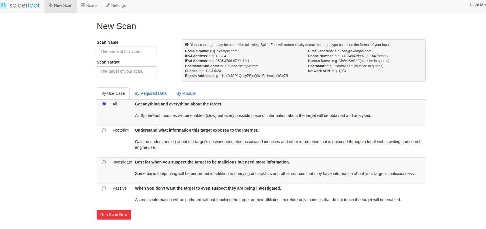

We start by giving an email address, for this one we will use a known malicious phishing email admin@bestdgital[.]com

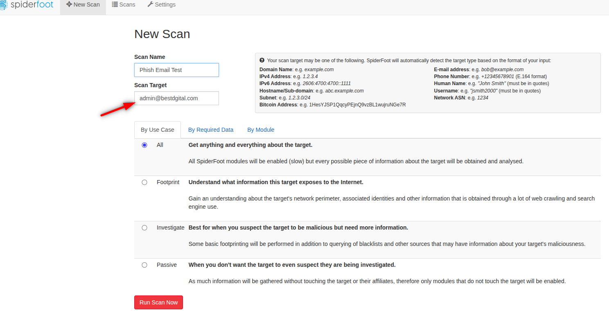

Next I select my three modules sfp_emailrep, sfp_hunter and sfp_hibp and run the scan

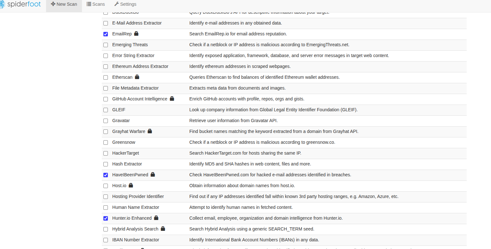

We see it found a bunch of data:

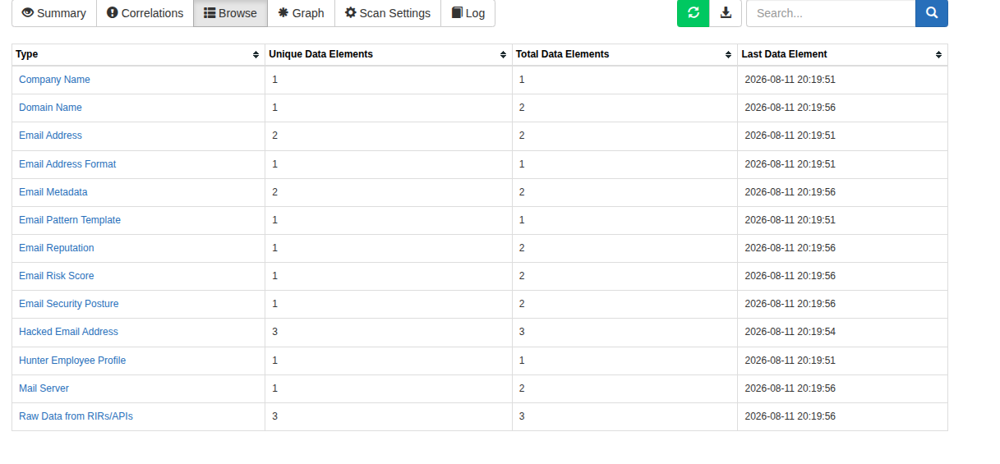

Here is the email reputation one:

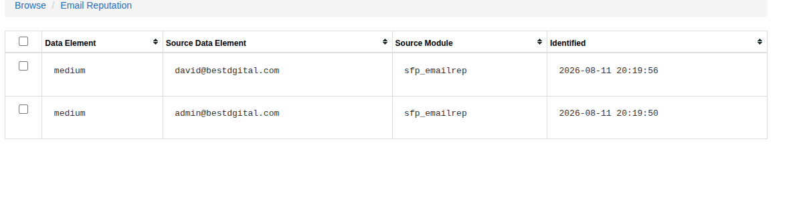

Here is the breaches it has been in:

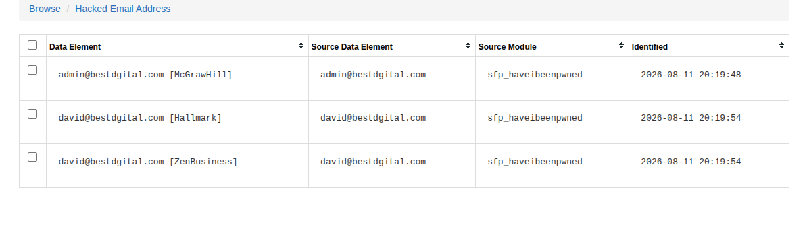

All kinds of useable data that the AI can consume to make its analysis. Again, we will not cover how I made this custom Spiderfoot, I just wanted you to see where Codex will get its data from.

## What is a Harness?
In AI, a harness is the supporting framework or "test rig" that surrounds an AI model to make it useful, measurable, or safe. The exact meaning depends on the context. Here are the most common uses:

### Evaluation harness (most common)
An evaluation harness runs standardized tests against an AI model to measure its performance. It typically:
1. Sends prompts to the model.
2. Collects responses.
3. Compares responses to expected answers.
4. Calculates metrics like accuracy, precision, latency, or cost.

Researchers use evaluation harnesses to compare different models objectively.

### Application harness
In software development, a harness is the code that connects an AI model to the rest of an application. It might:
1. Handle user input.
2. Format prompts.
3. Call the AI API.
4. Manage conversation history.
5. Retry failed requests.
6. Log outputs.
7. Apply safety checks.

Think of the harness as the glue between your application and the AI.

### Testing harness
Developers often create a harness to test changes before releasing them. For example:
1. Run 500 sample prompts.
2. Verify outputs haven't gotten worse.
3. Detect regressions after changing prompts or switching models.

This is similar to automated testing in traditional software.

### Agent harness
For AI agents, a harness manages everything around the model, including:
1. Memory
2. Tool usage (search, databases, APIs)
3. Planning
4. Error recovery
5. Permissions
6. Execution limits

The language model provides reasoning, while the harness orchestrates how it interacts with the outside world.

An analogy would be: Imagine an AI model is an engine. The harness is the rest of the car:
1. Steering
2. Dashboard
3. Transmission
4. Brakes
5. Safety systems

The engine generates power (the AI's responses), while the harness makes that power practical, reliable, and safe. So when someone says, "We built a harness for the model," they usually mean they built the infrastructure that runs, tests, manages, or evaluates the AI, not the AI model itself.

## Skills
Anthropic came up with a cool concept of applying "skills" to AI to give them ways to do things. They come in the form of a markdown file and have been adopted by a lot of the popular AI products out there today, Codex included. As of 2026 skills are a first-class part of Codex rather than just an experimental feature. OpenAI describes skills as bundles of instructions, resources, and scripts that Codex can discover and use automatically or that you can invoke explicitly. 

A skill is a set of instructions that teaches an AI agent how you want a particular job performed. Think of hiring a new cyber analyst. The analyst already knows cybersecurity, but you give them a procedure called: 
```
How We Check an Email Address
```
It might say:
1. Validate the email address.
2. Check EmailRep.
3. Record whether it's suspicious.
4. Check whether it's disposable.
5. Record domain reputation.
6. Don't call the address malicious based on one indicator.
7. Return the findings in this format...

That's essentially a skill. The AI already knows how to reason. The skill tells it your procedure for accomplishing a particular task.

SKILL.md is basically the procedure document. You might have:
```
email-reputation/
└── SKILL.md
```
Inside that it may look like:
```
---
name: email-reputation
description: Investigate the reputation of an email address.
---

# Email Reputation Investigation

When investigating an email address:

1. Validate the address.
2. Run the EmailRep lookup tool.
3. Examine:
   - reputation
   - suspicious
   - references
   - credentials leaked
   - disposable
4. Record the evidence.
5. Assign confidence.
6. Do not classify an address as malicious based on
   breach exposure alone.
```
There's nothing magical about the Markdown itself. It's essentially instructions written for the agent. You could essentially just do a ton of prompts to kind of achieve the same goal but a more efficient way would be to give your AI a library of Skills and only have it call up the ones it needs to perform the specific task. 

Skills and tools are NOT the same thing. This is probably the most important distinction.
1. A skill tells the agent what/how to do something.
2. A tool actually does something.

For example:
```
SKILL
"Check the reputation of the email using EmailRep."

Which then use a:

TOOL
emailrep.py

Which calls the:

EmailRep API

Which produces the:

RESULT
"suspicious: true"
```
The skill doesn't magically have access to EmailRep. You need something capable of performing the lookup. That could be Python:
```
python emailrep.py test@example.com
```
Or an MCP tool, API integration, command-line program, SpiderFoot module, etc. The skill teaches Codex when and how to use it. A skill is roughly analogous to an analyst SOP/playbook.

If you were to do a task programatically it may look like:
```
if email:
    run_emailrep()
    run_hibp()
    run_domain_check()
```
But with skills, you give the AI guidance:
```
Investigate the email.

Use available intelligence skills where appropriate.

If reputation indicators appear suspicious,
perform additional domain analysis.

If the domain has appeared previously,
search internal intelligence.

Don't perform unnecessary enrichment.
```

Now the AI decides what to do based upon what it discovers. That's where you're moving from a script toward an agent.

## Agents.md
1. AGENTS.md tells Codex who it is and how to behave in this project. The Claude equivalent is Claude.md
2. SKILL.md tells Codex how to perform one specific job.

Think again about running a CTI team. AGENTS.md = the analyst's job description and standing orders. Suppose you hire a cyber threat intelligence analyst. Before giving them individual procedures, you'd explain their overall role:
1. You are a CTI analyst.
2. Work only with authorized targets.
3. Preserve evidence.
4. Distinguish facts from assumptions.
5. Don't call something malicious based on one source.
6. Give confidence ratings.
7. Use our approved tools.
8. Document your findings.

That's AGENTS.md. For our eventual email POC, it could look roughly like:
```
# Email Intelligence Agent

You are a cyber threat intelligence analyst.

Your job is to investigate email addresses using the
available intelligence skills and tools.

## General Rules

- Preserve the original evidence.
- Distinguish facts from analytical conclusions.
- Never classify an email as malicious based on one indicator.
- Assign confidence to analytical conclusions.
- Prefer multiple independent sources when possible.
- Explain conflicting evidence.
- Do not fabricate unavailable intelligence.

## Output

Produce a concise intelligence assessment containing:

- Target
- Findings
- Evidence
- Assessment
- Confidence
- Recommended next steps
```
Notice that this doesn't explain how to query EmailRep. That's intentional, it's describing how our agent should operate generally.

So an easy way to break all of these down is as such:
1. Codex - Analyst    Does the investigation
2. AGENTS.md - Job description/standing orders   "You are a CTI analyst…"
3. SKILL.md - SOP/playbook   "Here's how we investigate email reputation"
4. Tool - Analyst's software   EmailRep API/script

## Workflow
The general workflow for Codex would look like this:
1. You type in "Investigate bob@example.com"
2. Codex first has the project's general instructions from AGENTS.md. It knows:
```
I'm doing CTI.

I need evidence.

I shouldn't make unsupported claims.

I have several skills available.
```
3. It looks at its available skills:
```
AVAILABLE SKILLS

email-reputation
Check reputation indicators for email addresses.

breach-search
Check known breach exposure.

brief-search
Search internal intelligence reports.

domain-intelligence
Investigate the domain associated with an email.
```
4. Then it may load the appropriate skill instructions and execute the required tools.

## Installation
Ok, now that we have the basic concepts out of the way, let's make this project. I am on an Ubuntu Linux machine so the install instructions may differ based on your environment. I will just show what I did on mine.

```
curl -fsSL https://chatgpt.com/codex/install.sh | sh
```

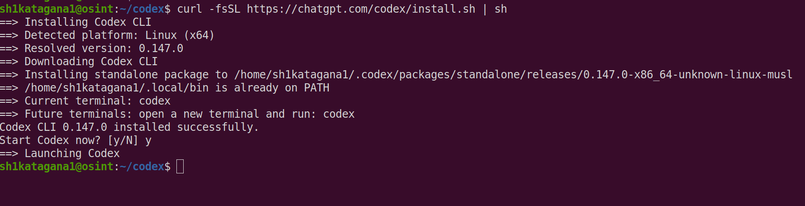

To verify after it installs run:
```
codex --version
```

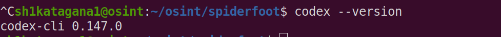

Next you need to login to your Chatgpt account
```
codex
```
This will give you a browser link to login. After all of that is done, if it drops you into a prompt, you can do ctrl+c to close it. Next create a directory you want Codex to operate inside of:
```
mkdir emailintel
cd emailintel
```
Then you run:
```
codex
```
It will ask if you trust this location, say yes. It should drop you to the main prompt:

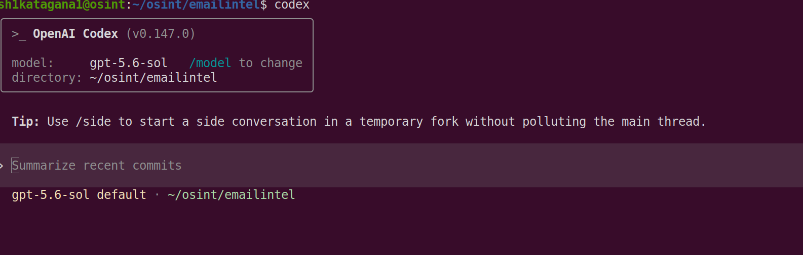

One thing you can do that is optional but recommended is:
```
git init
```
Then:
```
git status
```
At this point it's basically an empty repository. This gives us an easy history of every change Codex makes and lets us undo mistakes.

because Spiderfoot creates specific events with specific names, I want to map out all the pieces that will be utilized from Spiderfoot all the way to Codex
```
skills/

├── email-reputation/
│   └── SKILL.md
│
│   Understand:
│   EMAIL_REPUTATION
│   EMAIL_RISK_SCORE
│   EMAIL_SECURITY_POSTURE
│   EMAIL_METADATA
│   EMAIL_PROVIDER
│   MALICIOUS_EMAILADDR
│

├── breach-exposure/
│   └── SKILL.md
│
│   Understand:
│   EMAILADDR_COMPROMISED
│   EMAIL_BREACH
│   LEAKSITE_URL
│   LEAKSITE_CONTENT
│

├── email-context/
│   └── SKILL.md
│
│   Understand:
│   COMPANY_NAME
│   EMAIL_PATTERN
│   EMAIL_FORMAT
│   EMAIL_VERIFIED
│   HUNTER_PROFILE
│   HUMAN_NAME
│   JOB_TITLE
│   related EMAILADDRs
│   DOMAIN_DISPOSABLE
│   DOMAIN_WEBMAIL
│

└── email-assessment/
    └── SKILL.md

    Combine:
       reputation analysis
       breach analysis
       context analysis
       SpiderFoot correlations

    Produce:
       findings
       evidence
       risk
       confidence
       explanation
```
I ran a couple checks to make sure Codex can run my spiderfoot, which is one directory above it. It ran successfully and those steps arent relevant for this lesson. 

## AGENTS.md Creation
The next step is to create the project-level instructions file, AGENTS.md. OpenAI describes Skills as reusable workflow instructions, while AGENTS.md is where we can give Codex the standing rules for this repository. While your in Codex, type:
```
Create an AGENTS.md file for this project, but do not create any other files.

This project is a proof-of-concept email threat-intelligence agent.

The SpiderFoot installation is located at:
/home/sh1katagana1/osint/spiderfoot

SpiderFoot is the collection and correlation engine.
Codex is the analysis and orchestration layer.

For now:
- Do not modify the SpiderFoot installation.
- Do not modify SpiderFoot modules.
- Do not install packages.
- Do not make external API calls directly.
- Do not duplicate EmailRep, HIBP, or Hunter functionality.
- SpiderFoot results should be treated as evidence.
- SpiderFoot correlation alerts should be treated as analytical findings, not automatically as ground truth.
- Distinguish direct source observations, locally calculated values, and SpiderFoot correlations.
- Never classify an email as malicious from breach exposure alone.
- Preserve the source module for every important finding.
- Separate observed facts from analytical conclusions.
- Include confidence in conclusions.

The eventual workflow will be:
email target -> SpiderFoot -> events/correlations -> Codex skills -> final assessment.

Keep AGENTS.md short and beginner-readable.

Show me the proposed contents before writing the file.
```
The last sentence is intentional:
```
Show me the proposed contents before writing the file.
```
I want to see Codex's plan before letting it modify anything. That's useful while you're learning how the agent behaves. You should get back a proposed AGENTS.md rather than an immediate file write. Note also how I am being very explicit about what it can and cannot do and how I expect it to perform its function. Notice that AGENTS.md does not contain detailed instructions for interpreting EmailRep or HIBP. Those belong in skills later. 

When I put this in, I got this back from Codex:
```
Proposed AGENTS.md:

Email Threat-Intelligence POC

This project uses SpiderFoot for collection and correlation, and Codex for analysis and orchestration.

Workflow

email target -> SpiderFoot -> events/correlations -> Codex skills -> final assessment

Rules
Do not modify /home/sh1katagana1/osint/spiderfoot or its modules.
Do not install packages or make direct external API calls.
Do not duplicate EmailRep, HIBP, or Hunter functionality.
Treat SpiderFoot results as evidence.
Treat SpiderFoot correlation alerts as analytical findings, not automatic ground truth.
Preserve the SpiderFoot source module for every important finding.
Clearly separate:
direct source observations,
locally calculated values, and
SpiderFoot correlations.
Clearly separate observed facts from analytical conclusions.
Include confidence with every conclusion.
Never classify an email as malicious from breach exposure alone.

Confirm and I’ll create only this file.
```
We can see that it understands what I told it perfectly so now type in:
```
Confirmed. Create AGENTS.md exactly as proposed. Do not create or modify anything else.
```
You should now see an AGENTS.md file in your directory

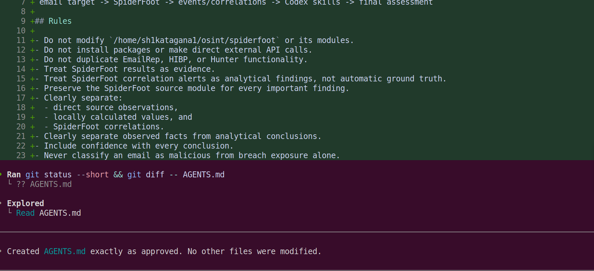
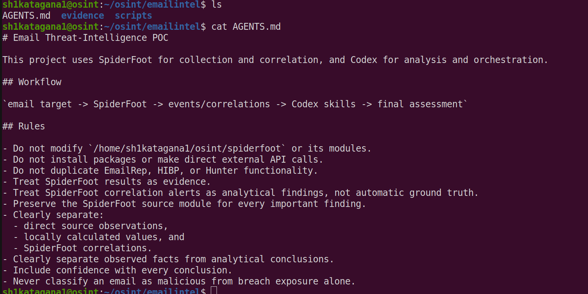


## Email Reputation Skills Creation
Now let's create one skill only: Email Reputation. Put this in the prompt:
```
I want to create our first Codex skill: email-reputation.

Do not create or modify any files yet.

The skill will teach Codex how to interpret email reputation evidence produced by my custom SpiderFoot sfp_emailrep module.

The relevant SpiderFoot module is:
/home/sh1katagana1/osint/spiderfoot/modules/sfp_emailrep.py

Read that module so you understand the actual events it produces and how values such as EMAIL_RISK_SCORE are calculated.

Do not modify the SpiderFoot module.

Design a beginner-readable SKILL.md for an "email-reputation" skill.

The skill should:
- operate on SpiderFoot results rather than calling EmailRep directly
- identify the relevant reputation/security events from sfp_emailrep
- preserve the source module/provenance
- distinguish direct EmailRep observations from values calculated locally by sfp_emailrep
- explain how EMAIL_RISK_SCORE is calculated if the module calculates it locally
- explain how MALICIOUS_EMAILADDR is generated if this module can generate it
- not treat breach exposure alone as evidence that an email owner is malicious
- provide a structured reputation assessment with evidence and confidence
- defer detailed breach analysis to a separate future breach-exposure skill
- not modify or query SpiderFoot yet

Propose the directory location and complete SKILL.md contents.

Show me the proposal before creating anything.
```
Again we are having it just show us it's proposal and it's not writing anything yet. As Codex knows where my python module is for emailrep.py, I am telling it to review that file to understand its inputs and outputs. I want it to see how the module calculates a risk score, so that it knows its Spiderfoot-only risk score, not one specifically by Emailrep.io. It should influence the analysis a bit but to not judge it entirely on that. I also make sure it knows that I will have a separate skill just for the breach things, so don't waste its time on that. 

This is the proposal it gave me, it's quite lengthy:
```
I’ll inspect the existing SpiderFoot module read-only, then propose only the skill location and full SKILL.md contents—without creating or changing files. • Explored └ Read sfp_emailrep.py ─────────────────────────────────────────────────────────────────────────────────────────────────────────────────────────────────── • The module confirms that EMAIL_RISK_SCORE is locally calculated and that MALICIOUS_EMAILADDR is emitted only when EmailRep’s details.malicious_activity is truthy. I’m using the skill-authoring guidance to keep the proposed SKILL.md compatible with Codex skills. • Explored └ Read SKILL.md (skill-creator skill) ─────────────────────────────────────────────────────────────────────────────────────────────────────────────────────────────────── • Proposed location: /home/sh1katagana1/osint/emailintel/.codex/skills/email-reputation/SKILL.md This keeps the skill project-scoped and does not alter the SpiderFoot installation. Proposed SKILL.md: ——— ## name: email-reputation description: Interpret email reputation and security evidence already produced by SpiderFoot's custom sfp_emailrep module. Use when assessing an email address from SpiderFoot events, including EmailRep reputation, compromise, malicious-activity, provider, security-posture, metadata, and risk-score findings. Do not call EmailRep directly. # Email Reputation Assessment Assess email reputation from existing SpiderFoot results only. Do not call EmailRep, query SpiderFoot, install packages, or modify SpiderFoot modules. The expected evidence source is SpiderFoot module sfp_emailrep (EmailRep). Preserve that module name and the original event data for each important finding. ## Evidence types Classify each item before interpreting it: - Direct EmailRep observation: A value returned by EmailRep and preserved in RAW_RIR_DATA, or a direct value relayed by sfp_emailrep. - Locally derived event: An event emitted by sfp_emailrep from an EmailRep field. - Locally calculated value: A value constructed or scored by sfp_emailrep; it is not an EmailRep score or verdict. - SpiderFoot correlation: A separate SpiderFoot alert or correlation. Treat it as an analytical finding, not ground truth. Use RAW_RIR_DATA as the most complete record of the EmailRep response when it is available. It is raw JSON from EmailRep, despite its generic event name. ## Relevant sfp_emailrep events Event Interpretation ━━━━━━━━━━━━━━━━━━━━━━━━ ━━━━━━━━━━━━━━━━━━━━━━━━━━━━━━━━━━━━━━━━━━━━━━━━━━━━━━━━━━━━━━━━━━━━━━━━━━━━━━━━━━━━━━━━━━━━━━━━━━━━━━━ EMAIL_REPUTATION Direct EmailRep top-level reputation value. ──────────────────────── ─────────────────────────────────────────────────────────────────────────────────────────────────────── EMAILADDR_COMPROMISED Locally derived from EmailRep details.credentials_leaked. The event data appends [Credentials Leaked]. ──────────────────────── ─────────────────────────────────────────────────────────────────────────────────────────────────────── EMAIL_BREACH Locally derived breach label, emitted when details.credentials_leaked is truthy. Defer detailed breach analysis to the future breach-exposure skill. ──────────────────────── ─────────────────────────────────────────────────────────────────────────────────────────────────────── MALICIOUS_EMAILADDR Locally derived from EmailRep details.malicious_activity. See “Malicious-email event” below. ──────────────────────── ─────────────────────────────────────────────────────────────────────────────────────────────────────── EMAIL_PROVIDER Locally derived from EmailRep details.free_provider and/or details.disposable. Values are Free Provider and Disposable Provider. ──────────────────────── ─────────────────────────────────────────────────────────────────────────────────────────────────────── EMAIL_SECURITY_POSTURE Locally constructed JSON containing EmailRep values for spoofable, spf_strict, dmarc_enforced, valid_mx, and accept_all. ──────────────────────── ─────────────────────────────────────────────────────────────────────────────────────────────────────── EMAIL_METADATA Locally constructed JSON containing EmailRep values for first_seen, last_seen, and days_since_domain_creation. ──────────────────────── ─────────────────────────────────────────────────────────────────────────────────────────────────────── EMAIL_RISK_SCORE A local score calculated by sfp_emailrep, not a score supplied by EmailRep. ──────────────────────── ─────────────────────────────────────────────────────────────────────────────────────────────────────── SOCIAL_MEDIA Profile value relayed from EmailRep details.profiles. ──────────────────────── ─────────────────────────────────────────────────────────────────────────────────────────────────────── MAILSERVER Primary MX value relayed from EmailRep details.primary_mx. ──────────────────────── ─────────────────────────────────────────────────────────────────────────────────────────────────────── DOMAIN_NAME Domain extracted locally from the input email address when EmailRep reports details.domain_exists as truthy. ## Interpret the risk score Treat EMAIL_RISK_SCORE as a transparent triage aid, not an EmailRep verdict. sfp_emailrep starts at 0 and adds: Condition Points ━━━━━━━━━━━━━━━━━━━━━━━━━━━━ ━━━━━━━━ details.credentials_leaked 40 ──────────────────────────── ──────── details.malicious_activity 50 ──────────────────────────── ──────── details.spoofable 20 ──────────────────────────── ──────── details.disposable 15 ──────────────────────────── ──────── details.spam 20 The possible total is 0–145. Report both the score and the contributing conditions. Do not describe it as an EmailRep-provided score, and do not invent thresholds that the module does not define. ## Interpret the malicious-email event sfp_emailrep emits MALICIOUS_EMAILADDR with data formatted as EmailRep [<email>] only when EmailRep returns a truthy details.malicious_activity value. Report this as: > EmailRep reported malicious activity; SpiderFoot sfp_emailrep generated MALICIOUS_EMAILADDR from that observation. This is meaningful reputation evidence, but retain the distinction between EmailRep’s underlying observation and SpiderFoot’s derived event. Consider corroboration, the raw response, and other source modules before reaching a high-confidence conclusion. ## Breach handling Do not classify an email address or its owner as malicious because EMAILADDR_COMPROMISED or EMAIL_BREACH exists. Credential exposure can affect legitimate victims. Record breach-related events as reputation context only, then defer scope, recency, data type, and impact analysis to the future breach-exposure skill. ## Assessment method 1. Select events whose source module is sfp_emailrep. 2. Preserve event type, exact value, source module, and parent/target email when available. 3. Prefer RAW_RIR_DATA to resolve ambiguity or verify which EmailRep fields caused a derived event. 4. Separate EmailRep observations, locally derived events, and locally calculated values. 5. Identify the risk-score contributors rather than relying on the total alone. 6. State conclusions cautiously. Missing events are not proof that a condition is false; the response may be incomplete or the module may not have produced all evidence. 7. Keep separate any SpiderFoot correlations from source observations. ## Output format Use this structure: ### Reputation assessment: <email address> Conclusion: <cautious assessment> Confidence: <low | medium | high> — <brief reason based on evidence quality and corroboration> Observed evidence Type Finding Provenance ━━━━━━━━━━━━━━━━━━━━━━━━━━━━━ ━━━━━━━━━━━ ━━━━━━━━━━━━━━━━━━━━━━━━━━━━━━━━━━━━━━━━━━━━━━━━━━━━━━━━━━━━━━━━━ Direct EmailRep observation <finding> sfp_emailrep; event <event type>; raw field <field> when known ───────────────────────────── ─────────── ───────────────────────────────────────────────────────────────── Locally derived event <finding> sfp_emailrep; event <event type>; derived from <EmailRep field> ───────────────────────────── ─────────── ───────────────────────────────────────────────────────────────── Locally calculated value <finding> sfp_emailrep; event EMAIL_RISK_SCORE; contributors <conditions> ───────────────────────────── ─────────── ───────────────────────────────────────────────────────────────── SpiderFoot correlation <finding> <correlation source>; analytical finding only Interpretation - <Explain how the evidence supports the conclusion.> - <State limitations, contradictions, or missing context.> - <If breach-related evidence exists, state that detailed analysis is deferred to breach-exposure.> Use low confidence for sparse, ambiguous, unverified, or correlation-only evidence; medium confidence for clear module evidence with limited corroboration; and high confidence only when strong source observations are consistent and corroborated. Never make an ownership or maliciousness claim from breach exposure alone. No files have been created or modified.
```
That proposal is very good, and I’d approve it with one small correction before creation: the YAML front matter needs proper --- delimiters. Right now Codex displayed:
```
## name: email-reputation
description: ...
```
For a Codex skill, we want:
```
---
name: email-reputation
description: Interpret email reputation and security evidence already produced by SpiderFoot's custom sfp_emailrep module. Use when assessing an email address from SpiderFoot events, including EmailRep reputation, compromise, malicious-activity, provider, security-posture, metadata, and risk-score findings. Do not call EmailRep directly.
---
```
I suggest doing this prompt for the approval:
```
Approved with one correction.

Create the skill at:

/home/sh1katagana1/osint/emailintel/.codex/skills/email-reputation/SKILL.md

Use the proposed contents, but make the metadata valid YAML front matter using:

---
name: email-reputation
description: Interpret email reputation and security evidence already produced by SpiderFoot's custom sfp_emailrep module. Use when assessing an email address from SpiderFoot events, including EmailRep reputation, compromise, malicious-activity, provider, security-posture, metadata, and risk-score findings. Do not call EmailRep directly.
---

Do not create or modify any other files.
```
You will find as we go along, we have to continually do this step for some reason. Here is our folder now when we do ls -la (keep in mind the screenshot may show more folders and files than you have, that's ok, this is the finished product)

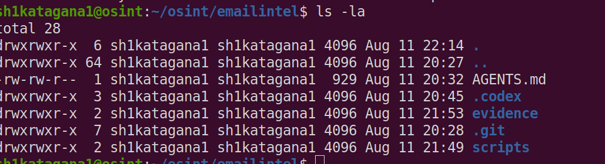

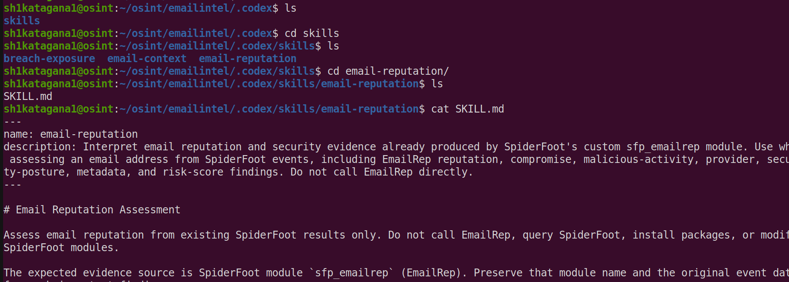

Once that is created this is the SKILL.md file I got:
```
---
name: email-reputation
description: Interpret email reputation and security evidence already produced by SpiderFoot's custom sfp_emailrep module. Use when assessing an email address from SpiderFoot events, including EmailRep reputation, compromise, malicious-activity, provider, security-posture, metadata, and risk-score findings. Do not call EmailRep directly.
---

# Email Reputation Assessment

Assess email reputation from existing SpiderFoot results only. Do not call EmailRep, query SpiderFoot, install packages, or modify SpiderFoot modules.

The expected evidence source is SpiderFoot module `sfp_emailrep` (EmailRep). Preserve that module name and the original event data for each important finding.

## Evidence types

Classify each item before interpreting it:

- **Direct EmailRep observation:** A value returned by EmailRep and preserved in `RAW_RIR_DATA`, or a direct value relayed by `sfp_emailrep`.
- **Locally derived event:** An event emitted by `sfp_emailrep` from an EmailRep field.
- **Locally calculated value:** A value constructed or scored by `sfp_emailrep`; it is not an EmailRep score or verdict.
- **SpiderFoot correlation:** A separate SpiderFoot alert or correlation. Treat it as an analytical finding, not ground truth.

Use `RAW_RIR_DATA` as the most complete record of the EmailRep response when it is available. It is raw JSON from EmailRep, despite its generic event name.

## Relevant `sfp_emailrep` events

| Event | Interpretation |
|---|---|
| `EMAIL_REPUTATION` | Direct EmailRep top-level `reputation` value. |
| `EMAILADDR_COMPROMISED` | Locally derived from EmailRep `details.credentials_leaked`. The event data appends `[Credentials Leaked]`. |
| `EMAIL_BREACH` | Locally derived breach label, emitted when `details.credentials_leaked` is truthy. Defer detailed breach analysis to the future `breach-exposure` skill. |
| `MALICIOUS_EMAILADDR` | Locally derived from EmailRep `details.malicious_activity`. See “Malicious-email event” below. |
| `EMAIL_PROVIDER` | Locally derived from EmailRep `details.free_provider` and/or `details.disposable`. Values are `Free Provider` and `Disposable Provider`. |
| `EMAIL_SECURITY_POSTURE` | Locally constructed JSON containing EmailRep values for `spoofable`, `spf_strict`, `dmarc_enforced`, `valid_mx`, and `accept_all`. |
| `EMAIL_METADATA` | Locally constructed JSON containing EmailRep values for `first_seen`, `last_seen`, and `days_since_domain_creation`. |
| `EMAIL_RISK_SCORE` | A local score calculated by `sfp_emailrep`, not a score supplied by EmailRep. |
| `SOCIAL_MEDIA` | Profile value relayed from EmailRep `details.profiles`. |
| `MAILSERVER` | Primary MX value relayed from EmailRep `details.primary_mx`. |
| `DOMAIN_NAME` | Domain extracted locally from the input email address when EmailRep reports `details.domain_exists` as truthy. |

## Interpret the risk score

Treat `EMAIL_RISK_SCORE` as a transparent triage aid, not an EmailRep verdict.

`sfp_emailrep` starts at `0` and adds:

| Condition | Points |
|---|---:|
| `details.credentials_leaked` | 40 |
| `details.malicious_activity` | 50 |
| `details.spoofable` | 20 |
| `details.disposable` | 15 |
| `details.spam` | 20 |

The possible total is 0–145. Report both the score and the contributing conditions. Do not describe it as an EmailRep-provided score, and do not invent thresholds that the module does not define.

## Interpret the malicious-email event

`sfp_emailrep` emits `MALICIOUS_EMAILADDR` with data formatted as `EmailRep [<email>]` only when EmailRep returns a truthy `details.malicious_activity` value.

Report this as:

> EmailRep reported malicious activity; SpiderFoot `sfp_emailrep` generated `MALICIOUS_EMAILADDR` from that observation.

This is meaningful reputation evidence, but retain the distinction between EmailRep’s underlying observation and SpiderFoot’s derived event. Consider corroboration, the raw response, and other source modules before reaching a high-confidence conclusion.

## Breach handling

Do not classify an email address or its owner as malicious because `EMAILADDR_COMPROMISED` or `EMAIL_BREACH` exists. Credential exposure can affect legitimate victims.

Record breach-related events as reputation context only, then defer scope, recency, data type, and impact analysis to the future `breach-exposure` skill.

## Assessment method

1. Select events whose source module is `sfp_emailrep`.
2. Preserve event type, exact value, source module, and parent/target email when available.
3. Prefer `RAW_RIR_DATA` to resolve ambiguity or verify which EmailRep fields caused a derived event.
4. Separate EmailRep observations, locally derived events, and locally calculated values.
5. Identify the risk-score contributors rather than relying on the total alone.
6. State conclusions cautiously. Missing events are not proof that a condition is false; the response may be incomplete or the module may not have produced all evidence.
7. Keep separate any SpiderFoot correlations from source observations.

## Output format

Use this structure:

### Reputation assessment: `<email address>`

**Conclusion:** `<cautious assessment>`

**Confidence:** `<low | medium | high>` — `<brief reason based on evidence quality and corroboration>`

**Observed evidence**

| Type | Finding | Provenance |
|---|---|---|
| Direct EmailRep observation | `<finding>` | `sfp_emailrep`; event `<event type>`; raw field `<field>` when known |
| Locally derived event | `<finding>` | `sfp_emailrep`; event `<event type>`; derived from `<EmailRep field>` |
| Locally calculated value | `<finding>` | `sfp_emailrep`; event `EMAIL_RISK_SCORE`; contributors `<conditions>` |
| SpiderFoot correlation | `<finding>` | `<correlation source>`; analytical finding only |

**Interpretation**

- `<Explain how the evidence supports the conclusion.>`
- `<State limitations, contradictions, or missing context.>`
- `<If breach-related evidence exists, state that detailed analysis is deferred to breach-exposure.>`

Use low confidence for sparse, ambiguous, unverified, or correlation-only evidence; medium confidence for clear module evidence with limited corroboration; and high confidence only when strong source observations are consistent and corroborated. Never make an ownership or maliciousness claim from breach exposure alone.

```

You may get additional prompts from codex asking for permission to modify files at certain locations:

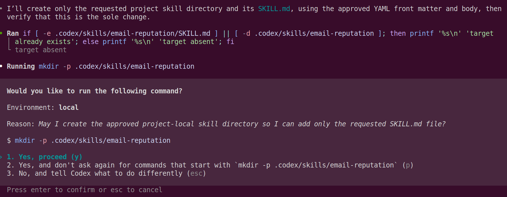

This is actually a nice concrete example of what "harness" means. GPT-5.6 Terra decided it needs to run mkdir, but the Codex harness controls whether the model is actually permitted to execute that command on your computer.

Now you can type /skills to see a list of your skills to make sure its in there (again, disregard the additional skills I have in my screenshot, this is the completed project)

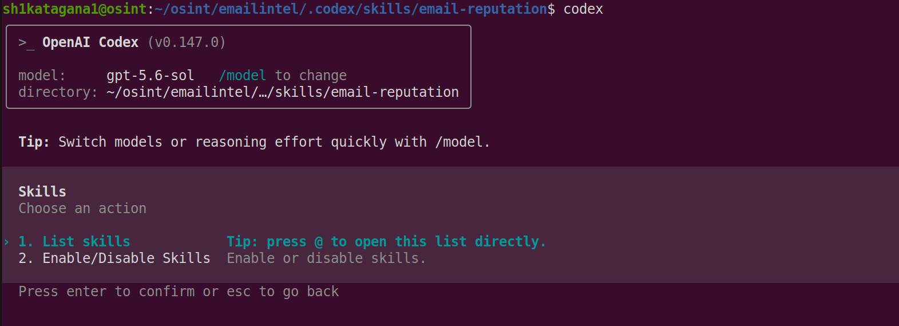

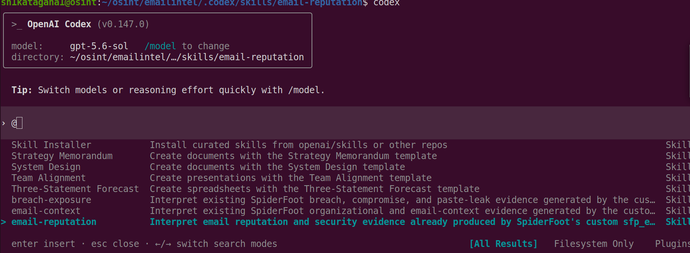

## Email Reputation Skill Check
Before we add the other skills, let's actually test this one. Close the skills window with Esc. Then give Codex this:
```
I want to test the email-reputation skill.

Do not run SpiderFoot, make API calls, modify files, or create anything.

First tell me:
1. Whether the email-reputation skill is available to you.
2. In your own words, when you would use it.
3. Which SpiderFoot events it teaches you to interpret.
4. How you understand EMAIL_RISK_SCORE.
5. How you understand MALICIOUS_EMAILADDR.

Do not perform an investigation yet.
```
This would confirm that everything needed to run this can be seen and accessed by Codex. It also let's me know if it understands the things I mention like risk score and breaches. Here is the proposal I got:

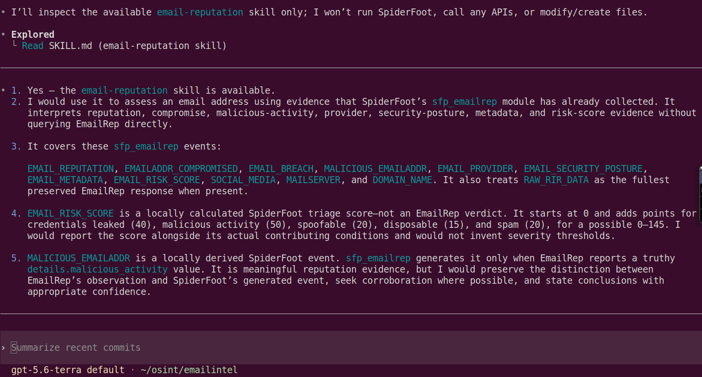

Its answers show it understood the important distinctions:
1. EMAIL_RISK_SCORE = your locally calculated 0–145 triage score, not an EmailRep score.
2. MALICIOUS_EMAILADDR = a SpiderFoot event derived from EmailRep's details.malicious_activity, not automatically a SpiderFoot correlation.
3. Breach evidence isn't automatically maliciousness.
4. Provenance needs to be preserved.
5. Corroboration affects confidence.

## Breach Exposure Skills Creation
Now we should repeat the process using the actual custom HIBP module I made for Spiderfoot rather than inventing generic HIBP behavior. Give Codex this:
```
I want to create our second Codex skill: breach-exposure.

Do not create or modify any files yet.

The skill will teach Codex how to interpret breach and compromise evidence produced by my custom SpiderFoot HIBP module.

The relevant SpiderFoot module is:
/home/sh1katagana1/osint/spiderfoot/modules/sfp_haveibeenpwned.py

Read that module so you understand exactly:
- which target/event types it watches
- which events it produces
- how EMAILADDR_COMPROMISED is generated
- what breach information is preserved
- how leak/paste events are represented
- what information comes directly from HIBP versus what sfp_haveibeenpwned constructs locally

Do not modify the SpiderFoot module.

Design a beginner-readable SKILL.md for a "breach-exposure" skill.

The skill should:
- operate only on existing SpiderFoot results rather than calling HIBP directly
- preserve source module/provenance
- distinguish direct HIBP observations from events/values constructed by the SpiderFoot module
- interpret EMAILADDR_COMPROMISED appropriately
- interpret any leak/paste events the module produces
- never treat breach exposure alone as evidence that an email address or its owner is malicious
- distinguish historical exposure from evidence of current compromise
- avoid claiming credentials are currently valid unless the evidence actually establishes that
- provide a structured breach-exposure assessment with evidence and confidence
- complement the existing email-reputation skill rather than duplicate it
- leave overall final risk synthesis to a future email-assessment skill
- not run or query SpiderFoot yet

Propose the project-scoped skill location and complete SKILL.md contents.

Use valid YAML front matter with --- delimiters.

Show me the proposal before creating anything.
```
Again we just want the proposal first. We are teaching it how to reason about breach evidence. Here is the proposal it gave me:
```
I’ll use the skill-creator guidance because this is a new Codex skill design, and I’ll inspect the HIBP module read-only. I’ll
return a complete proposal only—no files or SpiderFoot runs.

• Explored
└ Read SKILL.md (skill-creator skill), sfp_haveibeenpwned.py

───────────────────────────────────────────────────────────────────────────────────────────────────────────────────────────────────

• Proposed project-scoped location:

/home/sh1katagana1/osint/emailintel/.codex/skills/breach-exposure/SKILL.md

Read-only module findings:

sfp_haveibeenpwned watches EMAILADDR and PHONE_NUMBER.

It produces EMAILADDR_COMPROMISED, PHONE_NUMBER_COMPROMISED, LEAKSITE_URL, and LEAKSITE_CONTENT.

For every HIBP breach record returned, it takes the HIBP Name field and constructs:

EMAILADDR_COMPROMISED: <email> [<breach name>]

PHONE_NUMBER_COMPROMISED: <phone> [<breach name>]

It does not preserve the complete HIBP breach object or a raw HIBP response event; only the breach name survives in the
compromise event.

For email targets only, it additionally queries HIBP paste data. It uses HIBP Source and Id to construct known paste-host URLs,
fetches those URLs itself, and emits:

LEAKSITE_URL only if the fetched content contains the target email.

LEAKSITE_CONTENT containing the entire fetched paste content, parented to that URL event.

Thus, breach name, paste Source, and paste Id originate with HIBP; compromise event strings, recognized-host URL construction,
email-content matching, and emitted events are local SpiderFoot behavior. LEAKSITE_CONTENT is content fetched from the paste
host, not data delivered directly by HIBP.

Proposed complete SKILL.md:

———

name: breach-exposure

description: Interpret existing SpiderFoot breach, compromise, and paste-leak evidence generated by the custom sfp_haveibeenpwned
module. Use when assessing EMAILADDR_COMPROMISED, PHONE_NUMBER_COMPROMISED, LEAKSITE_URL, or LEAKSITE_CONTENT events and
explaining historical exposure, provenance, limits, and confidence. Do not call HIBP directly or run SpiderFoot.

Breach Exposure Assessment

Assess breach and compromise evidence already present in SpiderFoot results. Do not call Have I Been Pwned (HIBP), query or run
SpiderFoot, install packages, or modify SpiderFoot modules.

Use this skill for exposure analysis only. It complements email-reputation; do not duplicate EmailRep reputation, provider,
security-posture, metadata, or risk-score analysis. Leave overall risk synthesis to the future email-assessment skill.

The expected evidence source is SpiderFoot module sfp_haveibeenpwned. Preserve the module name, event type, exact event value,
and parent target/event when available.

Module behavior and evidence limits

sfp_haveibeenpwned watches EMAILADDR and PHONE_NUMBER.

It produces:

Event               Applies to            Interpretation
━━━━━━━━━━━━━━━━━━  ━━━━━━━━━━━━━━━━━━━━  ━━━━━━━━━━━━━━━━━━━━━━━━━━━━━━━━━━━━━━━━━━━━━━━━━━━━━━━━━━━━━━━━━━━━━━━━━━━━━━━━━━━━━━━
EMAILADDR_COMPRO    Email targets         A locally constructed event for each HIBP breach record returned for the email
MISED                                     address.
──────────────────  ────────────────────  ───────────────────────────────────────────────────────────────────────────────────────
PHONE_NUMBER_COM    Phone targets         A locally constructed event for each HIBP breach record returned for the phone
PROMISED                                  number.
──────────────────  ────────────────────  ───────────────────────────────────────────────────────────────────────────────────────
LEAKSITE_URL        Email targets only    A locally emitted URL event for a supported paste host after SpiderFoot fetched the
URL and found the target email in its content.
──────────────────  ────────────────────  ───────────────────────────────────────────────────────────────────────────────────────
LEAKSITE_CONTENT    Email targets only    Content fetched by SpiderFoot from the LEAKSITE_URL; it may include the target email
and other sensitive or unrelated material.

The module does not preserve a complete raw HIBP breach response or full breach metadata. Do not infer breach date, data classes,
verification status, or severity unless another preserved event or source explicitly provides it.

Classify the evidence

Separate observations from module-generated events and local checks.

Category                                    What it means
━━━━━━━━━━━━━━━━━━━━━━━━━━━━━━━━━━━━━━━━━━  ━━━━━━━━━━━━━━━━━━━━━━━━━━━━━━━━━━━━━━━━━━━━━━━━━━━━━━━━━━━━━━━━━━━━━━━━━━━━━━━━━━━━━
Direct HIBP observation                     A breach record was returned by HIBP; the module uses its Name value. For paste
results, HIBP provides Source and Id.
──────────────────────────────────────────  ─────────────────────────────────────────────────────────────────────────────────────
Locally constructed event                   EMAILADDR_COMPROMISED and PHONE_NUMBER_COMPROMISED are formatted by SpiderFoot as
<target> [<HIBP breach Name>].
──────────────────────────────────────────  ─────────────────────────────────────────────────────────────────────────────────────
Local verification and constructed value    For recognized paste hosts, SpiderFoot combines HIBP Source and Id into a URL,
fetches it, and checks whether the target email appears in the fetched content.
──────────────────────────────────────────  ─────────────────────────────────────────────────────────────────────────────────────
Relayed third-party content                 LEAKSITE_CONTENT is the full content fetched from a paste host. It is not content
returned directly by HIBP.
──────────────────────────────────────────  ─────────────────────────────────────────────────────────────────────────────────────
SpiderFoot correlation                      A separate analytical alert. Treat it as a finding requiring review, not as ground
truth.

Interpret compromise events

Treat EMAILADDR_COMPROMISED as evidence that HIBP returned at least one breach record associated with the email address.

Report it accurately:

HIBP returned a breach record named <breach name> for the email address; SpiderFoot sfp_haveibeenpwned generated
EMAILADDR_COMPROMISED.

Do not state or imply that:

the email address or its owner is malicious;

the breach is recent;

leaked credentials remain valid;

an account is currently compromised;

the owner controlled the account at the time of the breach;

a particular data type was exposed.

Breach exposure is historical exposure evidence unless separate, current, and reliable evidence establishes otherwise.
Credentials may have been changed, revoked, expired, or never associated with an active account.

Interpret PHONE_NUMBER_COMPROMISED in the same way, replacing email-address language with phone-number language.

Interpret paste-leak evidence

Treat LEAKSITE_URL as stronger than an unverified HIBP paste reference because the module fetched the URL and found the target
email in the returned content. It still does not establish that the material is current, authentic, complete, attributable to the
target’s owner, or usable for access.

Treat LEAKSITE_CONTENT cautiously:

Preserve the URL, source module, event type, and parent relationship.

Describe only the relevant, necessary characteristics of the content; avoid repeating sensitive content unnecessarily.

Distinguish the HIBP paste reference from content later fetched by SpiderFoot.

Do not infer valid passwords, current access, ownership, or malicious intent from the email’s presence in a paste.

If content includes apparent credentials, report them only as alleged historical exposed material unless independent evidence
establishes validity and currency.

The module emits no paste events for an HIBP paste result unless the source is a recognized host, the generated URL can be
fetched, and the target email is found in the fetched content. Therefore, missing paste events do not prove that HIBP reported no
paste exposure.

Assessment method

Select events whose source module is sfp_haveibeenpwned.

Preserve target, event type, exact value, source module, and parent event.

Identify the breach name within each compromise event, but label the event as locally constructed from HIBP's Name field.

Separate HIBP-derived breach or paste observations from SpiderFoot’s formatting, URL construction, fetching, and content
matching.

Treat LEAKSITE_CONTENT as fetched third-party content, not as raw HIBP evidence.

State whether evidence supports historical breach exposure, paste exposure, or both.

State the limits clearly: absence of time, data-class, validity, ownership, or current-compromise evidence when those facts
are not preserved.

Keep separate any SpiderFoot correlations and evidence from other source modules.

Do not assign an overall maliciousness or final risk verdict; defer that synthesis to email-assessment.

Output format

Breach-exposure assessment: <email address or phone number>

Conclusion: <cautious statement about historical breach and/or paste exposure>

Confidence: <low | medium | high> — <reason based on provenance, specificity, and corroboration>

Observed evidence

Type                                      Finding                                     Provenance
━━━━━━━━━━━━━━━━━━━━━━━━━━━━━━━━━━━━━━━━  ━━━━━━━━━━━━━━━━━━━━━━━━━━━━━━━━━━━━━━━━━━  ━━━━━━━━━━━━━━━━━━━━━━━━━━━━━━━━━━━━━━━━━━━
Direct HIBP observation                   <HIBP breach name or paste Source/Id,       sfp_haveibeenpwned; underlying HIBP field
when recoverable from event context>        <field>
────────────────────────────────────────  ──────────────────────────────────────────  ───────────────────────────────────────────
Locally constructed event                 <compromise event and exact value>          sfp_haveibeenpwned; event <event type>;
constructed from HIBP Name
────────────────────────────────────────  ──────────────────────────────────────────  ───────────────────────────────────────────
Local verification / constructed value    <paste URL and target-email content         sfp_haveibeenpwned; event LEAKSITE_URL;
match>                                      HIBP Source/Id plus SpiderFoot fetch and
match
────────────────────────────────────────  ──────────────────────────────────────────  ───────────────────────────────────────────
Relayed third-party content               <necessary description of paste content>    sfp_haveibeenpwned; event
LEAKSITE_CONTENT; fetched from <URL when
                                                                                      known>
────────────────────────────────────────  ──────────────────────────────────────────  ───────────────────────────────────────────
SpiderFoot correlation                    <finding>                                   <correlation source>; analytical finding
only

Interpretation

<State missing breach metadata, contradictions, or corroborating evidence.>

Use low confidence for sparse, ambiguous, correlation-only, or poorly preserved evidence. Use medium confidence for clear
sfp_haveibeenpwned events with limited context. Use high confidence only when clear module evidence is consistent and
corroborated by reliable, independent preserved evidence.

Never classify an email address, phone number, or owner as malicious from breach or paste exposure alone.

No files were created or modified, and no SpiderFoot or HIBP query was performed.

```
Again the proposal still isnt doing the YAML correctly so for approval prompt do this:
```
Approved with one correction.

Create the skill at:

/home/sh1katagana1/osint/emailintel/.codex/skills/breach-exposure/SKILL.md

Use the proposed contents, but make the metadata valid YAML front matter using:

---
name: breach-exposure
description: Interpret existing SpiderFoot breach, compromise, and paste-leak evidence generated by the custom sfp_haveibeenpwned module. Use when assessing EMAILADDR_COMPROMISED, PHONE_NUMBER_COMPROMISED, LEAKSITE_URL, or LEAKSITE_CONTENT events and explaining historical exposure, provenance, limits, and confidence. Do not call HIBP directly or run SpiderFoot.
---

Do not create or modify any other files.
```
During this, you may get a Failed to Patch error, it is expected and its just related to the directory not being created yet, which is fine. The created SKILL.md file looks like this:
```
---
name: breach-exposure
description: Interpret existing SpiderFoot breach, compromise, and paste-leak evidence generated by the custom sfp_haveibeenpwned module. Use when assessing EMAILADDR_COMPROMISED, PHONE_NUMBER_COMPROMISED, LEAKSITE_URL, or LEAKSITE_CONTENT events and explaining historical exposure, provenance, limits, and confidence. Do not call HIBP directly or run SpiderFoot.
---

# Breach Exposure Assessment

Assess breach and compromise evidence already present in SpiderFoot results. Do not call Have I Been Pwned (HIBP), query or run SpiderFoot, install packages, or modify SpiderFoot modules.

Use this skill for exposure analysis only. It complements `email-reputation`; do not duplicate EmailRep reputation, provider, security-posture, metadata, or risk-score analysis. Leave overall risk synthesis to the future `email-assessment` skill.

The expected evidence source is SpiderFoot module `sfp_haveibeenpwned`. Preserve the module name, event type, exact event value, and parent target/event when available.

## Module behavior and evidence limits

`sfp_haveibeenpwned` watches `EMAILADDR` and `PHONE_NUMBER`.

It produces:

| Event | Applies to | Interpretation |
|---|---|---|
| `EMAILADDR_COMPROMISED` | Email targets | A locally constructed event for each HIBP breach record returned for the email address. |
| `PHONE_NUMBER_COMPROMISED` | Phone targets | A locally constructed event for each HIBP breach record returned for the phone number. |
| `LEAKSITE_URL` | Email targets only | A locally emitted URL event for a supported paste host after SpiderFoot fetched the URL and found the target email in its content. |
| `LEAKSITE_CONTENT` | Email targets only | Content fetched by SpiderFoot from the `LEAKSITE_URL`; it may include the target email and other sensitive or unrelated material. |

The module does not preserve a complete raw HIBP breach response or full breach metadata. Do not infer breach date, data classes, verification status, or severity unless another preserved event or source explicitly provides it.

## Classify the evidence

Separate observations from module-generated events and local checks.

| Category | What it means |
|---|---|
| Direct HIBP observation | A breach record was returned by HIBP; the module uses its `Name` value. For paste results, HIBP provides `Source` and `Id`. |
| Locally constructed event | `EMAILADDR_COMPROMISED` and `PHONE_NUMBER_COMPROMISED` are formatted by SpiderFoot as `<target> [<HIBP breach Name>]`. |
| Local verification and constructed value | For recognized paste hosts, SpiderFoot combines HIBP `Source` and `Id` into a URL, fetches it, and checks whether the target email appears in the fetched content. |
| Relayed third-party content | `LEAKSITE_CONTENT` is the full content fetched from a paste host. It is not content returned directly by HIBP. |
| SpiderFoot correlation | A separate analytical alert. Treat it as a finding requiring review, not as ground truth. |

## Interpret compromise events

Treat `EMAILADDR_COMPROMISED` as evidence that HIBP returned at least one breach record associated with the email address.

Report it accurately:

> HIBP returned a breach record named `<breach name>` for the email address; SpiderFoot `sfp_haveibeenpwned` generated `EMAILADDR_COMPROMISED`.

Do not state or imply that:

- the email address or its owner is malicious;
- the breach is recent;
- leaked credentials remain valid;
- an account is currently compromised;
- the owner controlled the account at the time of the breach;
- a particular data type was exposed.

Breach exposure is historical exposure evidence unless separate, current, and reliable evidence establishes otherwise. Credentials may have been changed, revoked, expired, or never associated with an active account.

Interpret `PHONE_NUMBER_COMPROMISED` in the same way, replacing email-address language with phone-number language.

## Interpret paste-leak evidence

Treat `LEAKSITE_URL` as stronger than an unverified HIBP paste reference because the module fetched the URL and found the target email in the returned content. It still does not establish that the material is current, authentic, complete, attributable to the target’s owner, or usable for access.

Treat `LEAKSITE_CONTENT` cautiously:

- Preserve the URL, source module, event type, and parent relationship.
- Describe only the relevant, necessary characteristics of the content; avoid repeating sensitive content unnecessarily.
- Distinguish the HIBP paste reference from content later fetched by SpiderFoot.
- Do not infer valid passwords, current access, ownership, or malicious intent from the email’s presence in a paste.
- If content includes apparent credentials, report them only as alleged historical exposed material unless independent evidence establishes validity and currency.

The module emits no paste events for an HIBP paste result unless the source is a recognized host, the generated URL can be fetched, and the target email is found in the fetched content. Therefore, missing paste events do not prove that HIBP reported no paste exposure.

## Assessment method

1. Select events whose source module is `sfp_haveibeenpwned`.
2. Preserve target, event type, exact value, source module, and parent event.
3. Identify the breach name within each compromise event, but label the event as locally constructed from HIBP's `Name` field.
4. Separate HIBP-derived breach or paste observations from SpiderFoot’s formatting, URL construction, fetching, and content matching.
5. Treat `LEAKSITE_CONTENT` as fetched third-party content, not as raw HIBP evidence.
6. State whether evidence supports historical breach exposure, paste exposure, or both.
7. State the limits clearly: absence of time, data-class, validity, ownership, or current-compromise evidence when those facts are not preserved.
8. Keep separate any SpiderFoot correlations and evidence from other source modules.
9. Do not assign an overall maliciousness or final risk verdict; defer that synthesis to `email-assessment`.

## Output format

### Breach-exposure assessment: `<email address or phone number>`

**Conclusion:** `<cautious statement about historical breach and/or paste exposure>`

**Confidence:** `<low | medium | high>` — `<reason based on provenance, specificity, and corroboration>`

**Observed evidence**

| Type | Finding | Provenance |
|---|---|---|
| Direct HIBP observation | `<HIBP breach name or paste Source/Id, when recoverable from event context>` | `sfp_haveibeenpwned`; underlying HIBP field `<field>` |
| Locally constructed event | `<compromise event and exact value>` | `sfp_haveibeenpwned`; event `<event type>`; constructed from HIBP `Name` |
| Local verification / constructed value | `<paste URL and target-email content match>` | `sfp_haveibeenpwned`; event `LEAKSITE_URL`; HIBP `Source`/`Id` plus SpiderFoot fetch and match |
| Relayed third-party content | `<necessary description of paste content>` | `sfp_haveibeenpwned`; event `LEAKSITE_CONTENT`; fetched from `<URL when known>` |
| SpiderFoot correlation | `<finding>` | `<correlation source>`; analytical finding only |

**Interpretation**

- `<Explain what the evidence supports about historical exposure.>`
- `<Distinguish exposure from current compromise and credential validity.>`
- `<State missing breach metadata, contradictions, or corroborating evidence.>`
- `<State that overall reputation and final risk synthesis are outside this assessment.>`

Use low confidence for sparse, ambiguous, correlation-only, or poorly preserved evidence. Use medium confidence for clear `sfp_haveibeenpwned` events with limited context. Use high confidence only when clear module evidence is consistent and corroborated by reliable, independent preserved evidence.

Never classify an email address, phone number, or owner as malicious from breach or paste exposure alone.
```

## Hunter Skill Creation
Paste this into Codex:
```
I want to create our third Codex skill: email-context.

Do not create or modify any files yet.

The skill will teach Codex how to interpret organizational and email-context evidence produced by my custom SpiderFoot Hunter module.

The relevant SpiderFoot module is:
/home/sh1katagana1/osint/spiderfoot/modules/sfp_hunter.py

Read that module so you understand exactly:
- which target/event types it watches
- which events it produces
- how Hunter is reached during an email investigation
- organization/company information it produces
- email patterns and formats
- discovered and verified email addresses
- human names and job titles
- social/profile information
- disposable/webmail/accept-all information
- related domains and other contextual evidence
- what comes directly from Hunter versus what sfp_hunter constructs locally

Do not modify the SpiderFoot module.

Also consider the existing email-reputation and breach-exposure skills so this new skill complements rather than duplicates them.

Design a beginner-readable SKILL.md for an "email-context" skill.

The skill should:
- operate only on existing SpiderFoot results rather than calling Hunter directly
- preserve source module/provenance
- distinguish Hunter observations from events or values constructed locally by sfp_hunter
- explain what discovered related email addresses mean without assuming they belong to the investigation target
- interpret company, email-pattern, email-format, verification, job-title, profile, webmail, disposable, accept-all, and related-domain evidence according to what the actual module produces
- not treat a Hunter-discovered email address as malicious merely because it is related to the same domain
- not use breach exposure as a maliciousness indicator
- complement email-reputation and breach-exposure
- provide a structured email-context assessment with evidence and confidence
- leave overall final risk synthesis to a future email-assessment skill
- not run or query SpiderFoot yet

Propose the project-scoped skill location and complete SKILL.md contents.

Use valid YAML front matter with --- delimiters.

Show me the proposal before creating anything.
```
Hunter itself isn't really doing "email reputation." It's expanding the domain context surrounding the original email. It did the proper proposal we expect, except for the YAML format again, so for approval prompt, type in:
```
Approved with one correction.

Create the skill at:

/home/sh1katagana1/osint/emailintel/.codex/skills/email-context/SKILL.md

Use the proposed contents, but make the metadata valid YAML front matter using:

---
name: email-context
description: Interpret existing SpiderFoot organizational and email-context evidence generated by the custom sfp_hunter module. Use when assessing Hunter domain-search results, company names, email patterns and formats, discovered or verified addresses, names, job titles, profiles, provider characteristics, related domains, and contextual relationships. Do not call Hunter directly or run SpiderFoot.
---

Do not create or modify any other files.
```
The finished SKILL.md looks like:
```
---
name: email-context
description: Interpret existing SpiderFoot organizational and email-context evidence generated by the custom sfp_hunter module. Use when assessing Hunter domain-search results, company names, email patterns and formats, discovered or verified addresses, names, job titles, profiles, provider characteristics, related domains, and contextual relationships. Do not call Hunter directly or run SpiderFoot.
---

# Email Context Assessment

Assess organizational and email-context evidence already present in SpiderFoot results. Do not call Hunter, query or run SpiderFoot, install packages, or modify SpiderFoot modules.

Use this skill to explain context and relationships around a queried domain or email investigation. It complements:

- `email-reputation`, which interprets EmailRep reputation and security-posture evidence.
- `breach-exposure`, which interprets HIBP breach and paste-leak exposure.

Do not duplicate those skills or produce an overall final risk verdict. Leave final synthesis to the future `email-assessment` skill.

The expected evidence source is SpiderFoot module `sfp_hunter`. Preserve the source module, event type, exact event value, input target, and parent event for every important finding.

## Module behavior and scope

`sfp_hunter` watches `DOMAIN_NAME` and `INTERNET_NAME`; it does not watch `EMAILADDR` directly.

For each input domain or internet name, it queries Hunter's domain-search result set in pages of up to 100 email records. The queried input may have originated from an email investigation when another module first emitted the email's domain.

The module emits:

| Event | Interpretation |
|---|---|
| `RAW_RIR_DATA` | Full Hunter `data` object from the first returned page, preserved as JSON. |
| `COMPANY_NAME` | Hunter `organization` value. |
| `EMAIL_PATTERN` | Hunter `pattern` value. |
| `EMAIL_FORMAT` | A local example constructed from the Hunter pattern and the queried domain. |
| `DOMAIN_DISPOSABLE` | Locally derived when Hunter `disposable` is `true`. |
| `DOMAIN_WEBMAIL` | Locally derived when Hunter `webmail` is `true`. |
| `AFFILIATE_INTERNET_NAME` | Hunter `linked_domains` values relayed as related-domain events. |
| `HUNTER_PROFILE` | A full Hunter email-record JSON object, preserved for each returned address. |
| `EMAILADDR` | A returned Hunter email-record `value`, unless SpiderFoot locally categorizes it as generic. |
| `EMAILADDR_GENERIC` | A returned Hunter email-record `value` whose local part matches SpiderFoot's configured `_genericusers` list. |
| `EMAIL_VERIFIED` | Locally derived when a Hunter email record has `verification.status` equal to `valid`. |
| `HUMAN_NAME` | Hunter email-record `first_name` and/or `last_name`, locally combined into one name. |
| `JOB_TITLE` | Hunter email-record `position` value. |
| `LINKEDIN_URL` | Hunter email-record `linkedin` value. |
| `TWITTER_URL` | Hunter email-record `twitter` value. |
| `PHONE_NUMBER` | Hunter email-record `phone_number` value. |

The module sets event confidence from Hunter's email-record `confidence` when available. Preserve that value as source-provided record confidence; do not treat it as a universal truth or as a maliciousness score.

## Classify the evidence

Separate Hunter observations from SpiderFoot's local transformations.

| Category | What it means |
|---|---|
| Direct Hunter observation | A value preserved in `RAW_RIR_DATA` or `HUNTER_PROFILE`, including organization, pattern, linked domains, email-record values, verification data, names, positions, profiles, phones, and Hunter record confidence. |
| Relayed Hunter value | A value emitted directly from a Hunter field, such as `COMPANY_NAME`, `EMAIL_PATTERN`, `JOB_TITLE`, `LINKEDIN_URL`, `TWITTER_URL`, `PHONE_NUMBER`, or `AFFILIATE_INTERNET_NAME`. |
| Locally derived event | `DOMAIN_DISPOSABLE`, `DOMAIN_WEBMAIL`, and `EMAIL_VERIFIED`, emitted from specific Hunter fields or statuses. |
| Locally constructed value | `EMAIL_FORMAT`, a readable example built from the Hunter pattern and queried input domain; `HUMAN_NAME`, a combination of first and last name; and the `EMAILADDR` versus `EMAILADDR_GENERIC` categorization. |
| SpiderFoot correlation | A separate alert or correlation. Treat it as an analytical finding requiring review, not as ground truth. |

Use `HUNTER_PROFILE` to determine whether a name, title, profile URL, phone number, verification status, or confidence belongs to a specific discovered address. The module parents all of those separate events to the queried domain event, not to the individual email record.

## Interpret domain and organization evidence

Treat `COMPANY_NAME` as Hunter's organization value for the queried domain or internet name. It is useful organizational context, but does not independently prove legal ownership, current corporate control, or that every address on the domain belongs to that organization.

Treat `EMAIL_PATTERN` as Hunter's reported convention for the domain. Treat `EMAIL_FORMAT` only as a locally generated example of that pattern, such as `first.last@example.com`; it is not proof that an individual address exists.

Treat `AFFILIATE_INTERNET_NAME` as a Hunter-reported linked domain. It indicates a contextual relationship in Hunter's data, not necessarily common ownership, operational control, trust, or malicious affiliation.

## Interpret discovered and verified email addresses

Treat `EMAILADDR` and `EMAILADDR_GENERIC` as Hunter-discovered email records associated with the queried domain result.

Do not assume a discovered address belongs to the investigation target merely because it shares the same domain. A shared domain can indicate organizational context, public contact information, aliases, role accounts, stale data, or another relationship that requires corroboration.

Treat `EMAILADDR_GENERIC` as a local SpiderFoot categorization based on the configured list of generic local parts. It is not a Hunter verdict and does not establish that an address is shared, monitored, or non-personal.

Treat `EMAIL_VERIFIED` as:

> Hunter recorded `verification.status` as `valid`; SpiderFoot `sfp_hunter` generated `EMAIL_VERIFIED` from that status.

This supports confidence that Hunter considered the address valid at the time of its record. It does not prove current inbox access, ownership, account activity, identity, or that the address can receive mail now.

## Interpret people and profile evidence

Treat `HUMAN_NAME`, `JOB_TITLE`, `LINKEDIN_URL`, `TWITTER_URL`, and `PHONE_NUMBER` as Hunter email-record context only when the corresponding `HUNTER_PROFILE` preserves the relationship to a specific email address.

Do not infer that:

- a name is the current owner or user of an email address;
- a job title is current or authoritative;
- a social profile belongs to the named person or email address;
- a phone number is personal, current, or controlled by the target.

Describe these values as reported contextual attributes and state when the linking profile record is absent or ambiguous.

## Interpret provider and accept-all evidence

Treat `DOMAIN_DISPOSABLE` as a locally derived event from Hunter `disposable: true`. Treat `DOMAIN_WEBMAIL` as a locally derived event from Hunter `webmail: true`.

These describe Hunter's domain classification. They do not establish maliciousness, spam activity, account ownership, or the current behavior of every address at the domain.

`sfp_hunter` does not produce an accept-all-specific event. If `accept_all` appears in preserved `RAW_RIR_DATA`, treat it as a direct Hunter observation and report it precisely. If it is absent, do not infer that the domain is not accept-all; the response may be incomplete or the relevant raw data may not be preserved.

## Assessment method

1. Select events whose source module is `sfp_hunter`.
2. Preserve the queried domain or internet-name target, event type, exact value, source module, and parent event.
3. Use `RAW_RIR_DATA` for domain-level Hunter evidence when available; remember it represents only the first fetched page.
4. Use `HUNTER_PROFILE` to connect an email address to a name, title, profile, phone number, verification status, or Hunter confidence.
5. Label relayed Hunter fields, locally derived events, and locally constructed values separately.
6. Treat patterns, formats, linked domains, and shared-domain addresses as context rather than identity, ownership, or maliciousness evidence.
7. Treat Hunter verification as a recorded status, not proof of current access or identity.
8. Keep reputation evidence, breach exposure, and SpiderFoot correlations separate from Hunter context.
9. Do not classify an address as malicious because it was discovered by Hunter, shares a related domain, or has breach exposure.

## Output format

### Email-context assessment: `<email address or queried domain>`

**Conclusion:** `<cautious statement about organizational and address context>`

**Confidence:** `<low | medium | high>` — `<reason based on preserved Hunter records, specificity, and corroboration>`

**Observed evidence**

| Type | Finding | Provenance |
|---|---|---|
| Direct Hunter observation | `<finding>` | `sfp_hunter`; event `RAW_RIR_DATA` or `HUNTER_PROFILE`; raw field `<field>` |
| Relayed Hunter value | `<finding>` | `sfp_hunter`; event `<event type>`; Hunter field `<field>` |
| Locally derived event | `<finding>` | `sfp_hunter`; event `<event type>`; derived from Hunter `<field or status>` |
| Locally constructed value | `<finding>` | `sfp_hunter`; event `<event type>`; construction `<method>` |
| SpiderFoot correlation | `<finding>` | `<correlation source>`; analytical finding only |

**Interpretation**

- `<Explain the supported organizational, domain, or contact context.>`
- `<State whether individual-record links are preserved or ambiguous.>`
- `<Distinguish discovered or verified status from ownership, identity, and current access.>`
- `<State limits, missing context, and any independent corroboration.>`
- `<State that reputation, breach exposure, and final risk synthesis are outside this assessment.>`

Use low confidence for sparse, ambiguous, correlation-only, or unlinked evidence. Use medium confidence for clear Hunter records with limited independent corroboration. Use high confidence only when specific Hunter profile evidence is consistent and corroborated by reliable, independent preserved sources.

Never treat a Hunter-discovered address, shared domain, related domain, or breach exposure as evidence that an email address or its owner is malicious.
```

Now when we run /skills we should see all 3:
```
breach-exposure
email-context
email-reputation
```

## Extract Spiderfoot Results
We're ready to move on to extracting your existing completed scan. As I did already run a scan in Spiderfoot, it will be in its database with a specific scan number. Future improvements I will add running the scan and Codex at the same time, but for this lesson, we will check if it can interpret a scan properly. We want it to determine how your particular SpiderFoot 4 installation stores scan results and correlations. This means we want it to analyze the spiderfoot folder and see how all the secret sauce works so it knows where to pull scan data from. Give Codex:
```
I want to begin integrating this EmailIntel POC with my existing SpiderFoot installation.

Do not create, modify, or delete any files.
Do not run a new SpiderFoot scan.
Do not make external API calls.
Do not install packages.

SpiderFoot is located at:
/home/sh1katagana1/osint/spiderfoot

I have confirmed that SpiderFoot currently works using the system python3 without activating its virtual environment. For example, both of these work:

python3 sf.py -s acidicloop@gmail.com -m sfp_emailrep
python3 sf.py -l 127.0.0.1:5001

For now, assume system python3 is usable. Do not modify or remove the existing venv.

I already have a completed email test scan in SpiderFoot that I want to use as our first integration test.

Inspect the SpiderFoot source code and local data storage read-only and determine:

1. Where completed scan data is stored.
2. How scans are identified.
3. How we can list existing scans.
4. How events for one completed scan can be retrieved.
5. What fields are available for each event, especially event type, data, source module, parent/source relationship, and target.
6. Where SpiderFoot correlation results are stored.
7. How correlation results for one scan can be retrieved.
8. Whether SpiderFoot already has Python classes/functions or CLI functionality we should reuse instead of querying its SQLite database directly.
9. What the cleanest read-only integration method would be for EmailIntel.

You may run read-only commands and inspect the SQLite database schema/data if necessary, but do not alter anything.

Do not implement the adapter yet.

Report what you find and propose the simplest architecture for retrieving one existing completed scan's events and correlations.
```
Here is the result it gave me:
```
Inspection completed read-only; no scans, files, packages, or external API calls were made. 1. Completed scan data is in SQLite at /home/sh1katagana1/.spiderfoot/spiderfoot.db. SpiderFoot derives this from SPIDERFOOT_DATA, otherwise ~/.spiderfoot/. /home/sh1katagana1/osint/spiderfoot/spiderfoot/helpers.py:79 /home/sh1katagana1/ osint/spiderfoot/sf.py:65 2. A scan is identified by tbl_scan_instance.guid: an uppercase, eight-hex-character UUID prefix (for example, 6E2E32AC). /home/ sh1katagana1/osint/spiderfoot/spiderfoot/helpers.py:767 3. Existing scans are listed through SpiderFootDb.scanInstanceList(), returning ID, name, seed target, timestamps, status, and event count. /home/sh1katagana1/osint/spiderfoot/spiderfoot/db.py:1464 The Web UI exposes this as GET /scanlist; sfcli.py can list it through a running local Web UI. 4. Events for one scan are retrieved through SpiderFootDb.scanResultEvent(scan_id, ...). It supports filtering by event type, source module, data, parent event hash, correlation ID, and false-positive flag. /home/sh1katagana1/osint/spiderfoot/ spiderfoot/db.py:905 The Web UI endpoint is /scaneventresults. 5. Event storage is tbl_scan_results; relevant fields are: Field Meaning ━━━━━━━━━━━━━━━━━━━━━━━━━━━━━━ ━━━━━━━━━━━━━━━━━━━━━━━━━━━━━━━━━━━━━━━━━━━━━ scan_instance_id Scan ID ────────────────────────────── ───────────────────────────────────────────── hash Unique event hash ────────────────────────────── ───────────────────────────────────────────── type Event type, e.g. EMAIL_REPUTATION ────────────────────────────── ───────────────────────────────────────────── data Observed value / JSON payload ────────────────────────────── ───────────────────────────────────────────── module Producing module, e.g. sfp_emailrep ────────────────────────────── ───────────────────────────────────────────── source_event_hash Parent event hash (ROOT for the root event) ────────────────────────────── ───────────────────────────────────────────── generated Timestamp in milliseconds ────────────────────────────── ───────────────────────────────────────────── confidence, visibility, risk SpiderFoot event metadata ────────────────────────────── ───────────────────────────────────────────── false_positive SpiderFoot false-positive flag scanResultEvent() also joins the parent event to return source_data, event description/category, and parent false-positive state. The scan target is held once in tbl_scan_instance.seed_target, not duplicated per event. 6. Correlations are stored in: - tbl_scan_correlation_results — correlation ID, scan ID, title, rule ID/name/description/risk, rule logic/YAML. - tbl_scan_correlation_results_events — many-to-many mapping from correlation ID to event hash. 7. Retrieve correlations with SpiderFootDb.scanCorrelationList(scan_id) and retrieve its evidence events via scanResultEvent(scan_id, correlationId=...). /home/sh1katagana1/osint/spiderfoot/spiderfoot/db.py:873 /home/sh1katagana1/ osint/spiderfoot/sfwebui.py:1722 8. Reusable functionality exists: - SpiderFootDb: best source of canonical query semantics. - Web UI JSON routes: /scanlist, /scanstatus, /scaneventresults, /scancorrelations. - sfcli.py: interactive HTTP client for the running Web UI (scans, data <id>, correlations <id>). However, SpiderFootDb opens SQLite read/write and may initialize/migrate a missing or incomplete database. It has no read-only mode. The CLI also requires a running Web UI. Therefore neither is ideal as the first strictly read-only adapter. The proposed first integration target is scan 6E2E32AC (“email test”, target acidicloop@gmail.com, FINISHED). It has 26 event rows from sfp_haveibeenpwned, sfp_emailrep, and sfp_hunter, plus one stored correlation. This is a strong integration fixture because it exercises all intended evidence sources and correlation linkage. Recommended architecture: EmailIntel adapter -> SQLite URI opened mode=ro + PRAGMA query_only -> scan metadata (tbl_scan_instance) -> normalized event records (results + parent event + event type) -> normalized correlation records (correlation results + mapped event hashes) -> EmailIntel analysis skills Use parameterized, read-only SQL modeled on SpiderFoot’s scanInstanceList, scanResultEvent, and scanCorrelationList queries. The adapter should preserve raw module output and label each normalized item as either: - direct SpiderFoot observation: event/module/parent/target; - locally calculated value: any EmailIntel aggregation; - SpiderFoot correlation: rule output with its mapped evidence hashes. Conclusion: a small, read-only SQLite adapter is the simplest and safest initial integration method. Confidence: high, based on the installed SpiderFoot 4.0 source and the existing database contents.
```

It found scan 6E2E32AC, named email test, target acidicloop@gmail.com, which I did run recently. It proposes to make a small python script to act as an adapter, which would be kind of a middleman that gets the data in Spiderfoot into a format that the AI understands, like JSON. So let's have it propose the normalized JSON shape first. That way we decide what information the skills receive before we write SQL around it. Put this in Codex:
```
I agree with using a small strictly read-only SQLite adapter for the POC.

Do not create or modify any files yet.
Do not run a new SpiderFoot scan.
Do not make external API calls.

Use completed scan 6E2E32AC ("email test") as the design fixture.

Before implementing anything, design the normalized JSON evidence structure that EmailIntel should produce from one completed SpiderFoot scan.

The structure must preserve enough information for the existing skills to reason correctly.

Include:

1. Scan metadata:
   - scan_id
   - scan_name
   - target
   - status
   - timestamps if useful

2. Events:
   - event hash
   - event type
   - exact data
   - source module
   - source/parent event hash
   - parent/source data if available
   - confidence
   - risk
   - visibility if useful
   - false-positive state
   - generated timestamp
   - any event description/category information available

3. Correlations:
   - correlation ID
   - title
   - rule ID/name
   - rule description
   - risk/severity
   - rule logic or YAML only if useful
   - evidence event hashes
   - enough linked event detail to let Codex understand why the rule fired

4. Provenance:
   - preserve SpiderFoot source module exactly
   - do not relabel SpiderFoot-derived values as EmailIntel calculations
   - clearly distinguish normal events from SpiderFoot correlations

5. Raw values:
   - preserve RAW_RIR_DATA and HUNTER_PROFILE exactly rather than summarizing them in the adapter.

Keep the schema simple enough for a beginner to understand and for Codex to consume reliably.

Also show a small illustrative JSON example using a few representative events from scan 6E2E32AC and its correlation, but do not dump sensitive/raw database content unnecessarily.

Do not implement the adapter yet.
```
The proposal came back as:
```
I’ll validate the exact event type labels and correlation-to-event linkage in the fixture, then provide a compact schema and a
redacted illustrative example only.

✔ You approved codex to run sqlite3 -readonly -header -column /home/sh1katagana1/.spiderfoot/spiderfoot.d... this time

• Ran sqlite3 -readonly -header -column /home/sh1katagana1/.spiderfoot/spiderfoot.db "SELECT r.hash, r.type, r.module,
│ r.source_event_hash, et.event_descr, et.event_type AS category, r.confidence, r.visibility, r.risk, r.false_positive FROM
│ tbl_scan_results r JOIN tbl_event_types et ON et.event=r.type WHERE r.scan_instance_id='6E2E32AC' ORDER BY r.generated;"
│ … +6 lines
└ hash type module data
---------------------------------------------------------------- ---------------------
… +5 lines (ctrl + t to view transcript)
16d92ade93b73ab61511b53335dc28aa9d4f48bef3f935ba34b93f95ba5df87d EMAILADDR_COMPROMISED sfp_haveibeenpwned
acidicloop@gmail.com [MortalOnline]

───────────────────────────────────────────────────────────────────────────────────────────────────────────────────────────────────

• Use one document per completed scan, with events as the primary evidence and correlations as separately labeled SpiderFoot
findings.

{
"schema_version": "emailintel.spiderfoot-evidence.v1",
"scan": {
"scan_id": "string",
"scan_name": "string",
"target": "string",
"status": "FINISHED",
"created_at": "ISO-8601 timestamp",
"started_at": "ISO-8601 timestamp",
"ended_at": "ISO-8601 timestamp"
},
"events": [
{
"provenance": {
"kind": "spiderfoot_event",
"source_module": "exact SpiderFoot module string"
},
"event_hash": "full SpiderFoot event hash",
"event_type": "SpiderFoot event type",
"event_description": "SpiderFoot event description",
"event_category": "SpiderFoot event category",
"data": "exact stored event data; never adapter-summarized",
"source_event_hash": "parent event hash",
"source_data": "parent event data when available",
"confidence": 0,
"risk": 0,
"visibility": 0,
"false_positive": false,
"generated_at": "ISO-8601 timestamp",
"generated_epoch_ms": 0
}
],
"correlations": [
{
"provenance": {
"kind": "spiderfoot_correlation"
},
"correlation_id": "SpiderFoot correlation ID",
"title": "SpiderFoot-generated title",
"rule": {
"id": "rule ID",
"name": "rule name",
"description": "rule description",
"risk": "HIGH|MEDIUM|LOW|INFO",
"logic": "stored rule YAML/logic"
},
"evidence_event_hashes": ["event hash"],
"evidence_events": [
{
"event_hash": "event hash",
"event_type": "SpiderFoot type",
"data": "exact event data",
"source_module": "exact module",
"source_event_hash": "parent hash"
}
]
}
]
}

Design notes:

data must always remain the exact SQLite value—string or JSON text—not an adapter interpretation.
RAW_RIR_DATA and HUNTER_PROFILE receive no special transformation: they are ordinary events whose data is preserved byte-for-
byte as stored. The adapter should not parse, redact, or summarize them.
Keep both evidence_event_hashes and resolved evidence_events: hashes preserve the native linkage; the small embedded records
make the correlation understandable without a second lookup.
rule.logic is useful for auditability but optional in normal analysis. Preserve it when available; skills should treat it as
rule metadata, not evidence.
The adapter performs no analysis or calculated risk. A correlation stays explicitly labeled spiderfoot_correlation, never an
EmailIntel conclusion.

Illustrative, deliberately minimized example from 6E2E32AC:

{
"schema_version": "emailintel.spiderfoot-evidence.v1",
"scan": {
"scan_id": "6E2E32AC",
"scan_name": "email test",
"target": "acidicloop@gmail.com",
"status": "FINISHED",
"created_at": "2026-08-12T01:14:41Z",
"started_at": "2026-08-12T01:14:42Z",
"ended_at": "2026-08-12T01:14:49Z"
},
"events": [
{
"provenance": {
"kind": "spiderfoot_event",
"source_module": "SpiderFoot UI"
},
"event_hash": "e26cc6a7e506dd7d0…",
"event_type": "EMAILADDR",
"event_description": "Email Address",
"event_category": "ENTITY",
"data": "acidicloop@gmail.com",
"source_event_hash": "ROOT",
"source_data": "acidicloop@gmail.com",
"confidence": 100,
"risk": 0,
"visibility": 100,
"false_positive": false,
"generated_at": "2026-08-12T01:14:42Z"
},
{
"provenance": {
"kind": "spiderfoot_event",
"source_module": "sfp_emailrep"
},
"event_hash": "e74310d4f3…",
"event_type": "EMAIL_REPUTATION",
"event_description": "Email Reputation",
"event_category": "DESCRIPTOR",
"data": "high",
"source_event_hash": "e26cc6a7e506dd7d0…",
"source_data": "acidicloop@gmail.com",
"confidence": 100,
"risk": 0,
"visibility": 100,
"false_positive": false,
"generated_at": "2026-08-12T01:14:47Z"
},
{
"provenance": {
"kind": "spiderfoot_event",
"source_module": "sfp_hunter"
},
"event_hash": "f5bd0c1e96…",
"event_type": "COMPANY_NAME",
"event_description": "Company Name",
"event_category": "ENTITY",
"data": "Gmail",
"source_event_hash": "05f1acc464129a47f…",
"source_data": "gmail.com",
"confidence": 100,
"risk": 0,
"visibility": 100,
"false_positive": false,
"generated_at": "2026-08-12T01:14:48Z"
}
],
"correlations": [
{
"provenance": {
"kind": "spiderfoot_correlation"
},
"correlation_id": "d2715a47250a3c5f20a37f3c2b630d67",
"title": "Email address reported in multiple breaches: acidicloop@gmail.com",
"rule": {
"id": "email_in_multiple_breaches",
"name": "An email address was reported to be in multiple breaches",
"risk": "HIGH",
"description": "SpiderFoot correlation finding; not an EmailIntel conclusion."
},
"evidence_event_hashes": [
"a959a9af6f…",
"5a39d6e72b…",
"16d92ade93…"
],
"evidence_events": [
{
"event_hash": "a959a9af6f…",
"event_type": "EMAILADDR_COMPROMISED",
"data": "acidicloop@gmail.com [Reverb-Nation]",
"source_module": "sfp_haveibeenpwned",
"source_event_hash": "e26cc6a7e506dd7d0…"
}
]
}
]
}

The correlation is correctly retained as a high-severity SpiderFoot finding, but downstream assessment must not classify the
email as malicious from breach exposure alone.
```


## Adapter Creation
Right now, SpiderFoot and Codex speak different "languages." SpiderFoot stores its results in database tables:
```
tbl_scan_instance
tbl_scan_results
tbl_scan_correlation_results
tbl_scan_correlation_results_events
```
Codex could be taught how all those tables work, but that would mix database plumbing with intelligence analysis. Instead, we put a tiny program in the middle. The adapter reads those tables and reorganizes them into something straightforward, roughly:
```
{
  "scan": {
    "id": "6E2E32AC",
    "name": "email test",
    "target": "acidicloop@gmail.com",
    "status": "FINISHED"
  },

  "events": [
    {
      "type": "EMAIL_REPUTATION",
      "data": "...",
      "module": "sfp_emailrep"
    },
    {
      "type": "EMAILADDR_COMPROMISED",
      "data": "...",
      "module": "sfp_haveibeenpwned"
    }
  ],

  "correlations": [
    {
      "severity": "HIGH",
      "rule": "...",
      "evidence": ["..."]
    }
  ]
}
```
The adapter should NOT be intelligent. For example, suppose SpiderFoot contains:
```
EMAILADDR_COMPROMISED
acidicloop@gmail.com [SomeBreach]
source module: sfp_haveibeenpwned
```
The adapter should not turn that into:
```
Risk: HIGH
Email is compromised
User should change password
```
That's analysis. Instead, it should faithfully produce:
```
{
  "type": "EMAILADDR_COMPROMISED",
  "data": "acidicloop@gmail.com [SomeBreach]",
  "module": "sfp_haveibeenpwned"
}
```
The next step is to have Codex implement only the read-only SpiderFoot scan exporter. Paste this into Codex:
```
I want to implement the first EmailIntel adapter.

Create only this file:

/home/sh1katagana1/osint/emailintel/scripts/export_spiderfoot_scan.py

Do not modify any other files.
Do not modify SpiderFoot.
Do not run a new SpiderFoot scan.
Do not make external API calls.
Do not install packages.

Purpose:
Read one existing completed SpiderFoot scan from:

/home/sh1katagana1/.spiderfoot/spiderfoot.db

and output one normalized JSON document to stdout.

Requirements:

1. Use only Python standard-library modules.
2. Use sqlite3.
3. Open the database strictly read-only using a SQLite URI with mode=ro.
4. Execute PRAGMA query_only=ON after connecting.
5. Use parameterized SQL for scan IDs and other input values.
6. Do not import SpiderFoot classes.
7. Do not write to SQLite.
8. Do not create output files yet; JSON goes to stdout.
9. Accept the SpiderFoot scan ID as a required command-line argument, for example:

python3 scripts/export_spiderfoot_scan.py 6E2E32AC

10. If the scan does not exist, print a useful error to stderr and exit non-zero.
11. Preserve exact SpiderFoot values. Do not analyze, summarize, redact, or reinterpret event data.
12. Convert timestamps to ISO-8601 UTC where appropriate while also preserving the original epoch-millisecond event timestamp.
13. Output valid JSON with this high-level structure:

{
  "schema_version": "emailintel.spiderfoot-evidence.v1",
  "scan": {},
  "events": [],
  "correlations": []
}

Scan metadata should include:
- scan_id
- scan_name
- target
- status
- created_at
- started_at
- ended_at

Each event should include:
- provenance.kind = "spiderfoot_event"
- provenance.source_module
- event_hash
- event_type
- event_description
- event_category
- data
- source_event_hash
- source_data
- confidence
- risk
- visibility
- false_positive
- generated_at
- generated_epoch_ms

Each correlation should include:
- provenance.kind = "spiderfoot_correlation"
- correlation_id
- title
- rule.id
- rule.name
- rule.description
- rule.risk
- rule.logic when available
- evidence_event_hashes
- evidence_events

Each embedded correlation evidence event should include:
- event_hash
- event_type
- data
- source_module
- source_event_hash

Use the installed SpiderFoot schema as the source of truth for table and column names.

Before writing the file:
- inspect the relevant SpiderFoot DB schema/source read-only if needed
- show me the proposed implementation plan
- show me the complete proposed script

Do not create the file until I approve it.
```
After you get the proposal do this approval prompt:
```
Approved. Create exactly:

/home/sh1katagana1/osint/emailintel/scripts/export_spiderfoot_scan.py

using the proposed script exactly as shown.

Do not create or modify any other files.

After creating it, do not run it yet. Show me that the file was created and the git diff/status only.
```
The result I got was:
```
Created scripts/export_spiderfoot_scan.py. It was not run. ?? .codex/ ?? AGENTS.md ?? scripts/ git diff has no output because the new script is untracked.
```

## Test The Agent
Now its time to test with running the adapter script against the scan I ran previously. Run this from the directory you have the script and you will need to change the Scan ID to whatever you have run in Spiderfoot
```
python3 scripts/export_spiderfoot_scan.py 6E2E32AC
```
This may give you errors depending on what Python version you are using, like for me I am one Python 3.8 and the script it made was for Python 3.9. If this happens to you, tell Codex to modify the script to your version. 
```
The adapter failed on my Ubuntu 20.04 system Python with:

TypeError: 'type' object is not subscriptable

at:

def event_record(row: sqlite3.Row) -> dict[str, Any]:

My system Python is likely Python 3.8.

Modify only:

/home/sh1katagana1/osint/emailintel/scripts/export_spiderfoot_scan.py

Make the script compatible with Python 3.8.

Specifically:
- import Dict and List from typing
- replace dict[...] type hints with Dict[...]
- replace list[...] type hints with List[...]
- preserve all existing behavior
- do not modify SQL, database paths, logic, or output schema
- do not modify any other file
- after editing, show me exactly what changed
- do not run the script yet
```
After the script runs successfully, you should get a long output of JSON based on the email address and scan results you check. Because my scan had output from all 3 modules of emailrep, hunter and HIBP, it activated all of those SKILLs. Let's see what Codex does with the three specialist skills by themselves. First, though, we need to give Codex the evidence. Since the exporter currently writes JSON to stdout, the easiest POC is to save one export into our project. Instead of doing that manually, tell Codex:
```
The SpiderFoot adapter has now been tested successfully with:

python3 scripts/export_spiderfoot_scan.py 6E2E32AC

It produced valid normalized JSON containing the scan metadata, events, and correlation.

I now want to perform our first Codex analysis of real SpiderFoot evidence.

Before doing that, I want to save this adapter output as a temporary evidence fixture.

Create only:

/home/sh1katagana1/osint/emailintel/evidence/6E2E32AC.json

by running:

python3 scripts/export_spiderfoot_scan.py 6E2E32AC > evidence/6E2E32AC.json

You may create the evidence directory if necessary.

Do not modify SpiderFoot.
Do not run a new SpiderFoot scan.
Do not make external API calls.
Do not modify the adapter or any skills.

After creating it, validate that the file contains valid JSON.

Do not analyze the evidence yet.
```
Now our first AI experiment becomes completely reproducible. Codex can read that same evidence repeatedly without touching SpiderFoot. Once Codex confirms the JSON file is valid, then we're ready for the fun part. We'll ask Codex something essentially like:
```
Analyze this completed email investigation using the appropriate available skills.
```
And we won't explicitly say:
```
use email-reputation, then breach-exposure, then email-context.
```
I specifically want to see whether Codex recognizes the evidence and chooses the appropriate skills itself. Give Codex this:
```
Analyze the completed SpiderFoot email investigation stored at:

/home/sh1katagana1/osint/emailintel/evidence/6E2E32AC.json

Do not run SpiderFoot.
Do not make external API calls.
Do not modify any files.
Do not create any new files.

Use whatever project skills are appropriate based on the evidence.

For this test, I want to see the reasoning workflow at a high level, not private chain-of-thought.

Before the final assessment, tell me:
1. Which skills you decided were relevant.
2. Why each skill was relevant.
3. Which major SpiderFoot event families each skill used.
4. How you treated the stored SpiderFoot correlation separately from source events.

Then produce a concise final email intelligence assessment containing:
- target
- reputation findings
- breach-exposure findings
- email/domain context
- SpiderFoot correlations
- overall assessment
- confidence
- important limitations

Do not treat breach exposure alone as maliciousness.
Do not treat SpiderFoot correlation severity as an automatic final verdict.
Preserve provenance when discussing important findings.
```
This may take a little time.

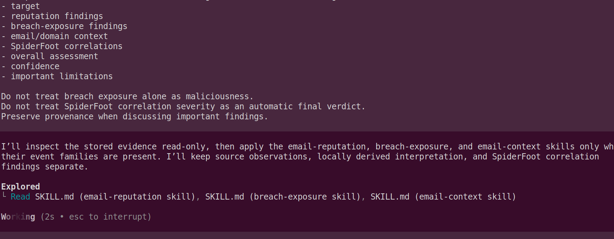

Here is Codex's final analysis on my email address:
```
I’ll inspect the stored evidence read-only, then apply the email-reputation, breach-exposure, and email-context skills only where
  their event families are present. I’ll keep source observations, locally derived interpretation, and SpiderFoot correlation
  findings separate.

• Explored
  └ Read SKILL.md (email-reputation skill), SKILL.md (breach-exposure skill), SKILL.md (email-context skill)

───────────────────────────────────────────────────────────────────────────────────────────────────────────────────────────────────

• All three project skills are relevant in principle: the investigation contains dedicated interpretation paths for EmailRep, HIBP,
  and Hunter evidence. I’m now mapping the actual stored events and parent/source relationships so I can state precisely which of
  those paths have usable evidence.

• Ran jq 'type, (if type=="object" then keys else length end)' evidence/6E2E32AC.json && jq -r '.. | objects | select(has("type")
  │ or has("eventType") or has("module") or has("source")) | [.type // .eventType // "", .module // .source // "",
  │ (.data // .value // "" | tostring)] | @tsv' evidence/6E2E32AC.json | sed -n '1,240p'
  └ "object"
    [
    … +3 lines (ctrl + t to view transcript)
      "schema_version"
    ]

• Ran jq '{schema_version, scan, event_count:(.events|length), correlation_count:(.correlations|length), first_event:.events[0],
  │ first_correlation:.correlations[0]}' evidence/6E2E32AC.json && jq -r '.events[] | [.event_type, .source_module, (.data|
  │ tostring), (.parent_event_id // ""), (.event_id // ""), (.confidence // "")] | @tsv' evidence/6E2E32AC.json
  └ {
      "schema_version": "emailintel.spiderfoot-evidence.v1",
    … +164 lines (ctrl + t to view transcript)
    COMPANY_NAME        Gmail            100
    DOMAIN_WEBMAIL        gmail.com            100

• Ran jq -r '.events[] | [.event_type, .provenance.source_module, .data, .source_event_hash, .source_data, (.confidence|tostring)]
  │ | @tsv' evidence/6E2E32AC.json && jq -r '.events | group_by(.provenance.source_module)[] | "\(.
  │ [0].provenance.source_module // "<none>")\t\(length)\t\([.[].event_type]|unique|join(","))"' evidence/6E2E32AC.json
  └ ROOT        acidicloop@gmail.com    ROOT    acidicloop@gmail.com    100
    EMAILADDR    SpiderFoot UI    acidicloop@gmail.com    ROOT    acidicloop@gmail.com    100
    … +32 lines (ctrl + t to view transcript)
    sfp_haveibeenpwned    10    EMAILADDR_COMPROMISED
    sfp_hunter    3    COMPANY_NAME,DOMAIN_WEBMAIL,RAW_RIR_DATA

───────────────────────────────────────────────────────────────────────────────────────────────────────────────────────────────────

• ## Skills and high-level reasoning workflow

  1. email-reputation
      - Relevant because sfp_emailrep preserved a raw EmailRep response plus reputation, provider, security-posture, metadata,
        breach, and locally calculated risk-score events.

      - Major event families used: RAW_RIR_DATA, EMAIL_REPUTATION, EMAILADDR_COMPROMISED, EMAIL_BREACH, EMAIL_PROVIDER,
        EMAIL_SECURITY_POSTURE, EMAIL_METADATA, EMAIL_RISK_SCORE, MAILSERVER, DOMAIN_NAME, and SOCIAL_MEDIA.

  2. breach-exposure
      - Relevant because sfp_haveibeenpwned generated ten named EMAILADDR_COMPROMISED events.
      - Major event family used: EMAILADDR_COMPROMISED.
      - No LEAKSITE_URL or LEAKSITE_CONTENT evidence was preserved.

  3. email-context
      - Relevant because sfp_hunter returned domain-level context for gmail.com.
      - Major event families used: RAW_RIR_DATA, COMPANY_NAME, and DOMAIN_WEBMAIL.
      - There were no Hunter email records, individual profiles, verification events, names, or job titles.

  I classified the evidence by provenance: raw third-party observations, SpiderFoot/module-derived events, and locally calculated
  values. I then considered consistency between modules without treating repeated representations of the same condition as
  independent corroboration.

  ### Treatment of the SpiderFoot correlation

  The correlation was evaluated separately from source evidence. SpiderFoot assigned HIGH severity after counting 11
  EMAILADDR_COMPROMISED events: ten named HIBP events from sfp_haveibeenpwned and one generic credentials-leaked event derived by
  sfp_emailrep.

  That count mixes detailed HIBP breach records with EmailRep’s broader exposure indicator, so it may partly count the same
  underlying exposure twice. The correlation establishes that SpiderFoot’s threshold rule fired; its severity is not an independent
  source observation or an automatic verdict about present compromise, weak passwords, or maliciousness.

  ## Final email intelligence assessment

  Target: acidicloop@gmail.com

  Reputation findings: EmailRep reported reputation high, suspicious: false, blacklisted: false, malicious_activity: false,
  malicious_activity_recent: false, and spam: false in sfp_emailrep → RAW_RIR_DATA. It also reported the address as deliverable on
  an existing, non-disposable free-provider domain with valid MX and accept_all: false.

  The module’s EMAIL_RISK_SCORE of 60 is locally calculated—not an EmailRep score. Its contributors were credentials leaked (+40)
  and spoofable: true (+20). It does not indicate a maliciousness threshold. EmailRep also reported spf_strict: false and
  dmarc_enforced: false; these stored service observations were not independently verified.

  Breach-exposure findings: HIBP returned ten named records for the address, preserved through sfp_haveibeenpwned as locally
  constructed EMAILADDR_COMPROMISED events:

  Reverb-Nation, 2844Breaches, MortalOnline, Collection1, Zynga, Cit0day, Tunngle, InternetArchive,
  SynthientCredentialStuffingThreatData, and Suno.

  This strongly supports historical exposure across multiple breach datasets. EmailRep independently reports credentials_leaked:
  true and data_breach: true, but says credentials_leaked_recent: false. The evidence does not establish current compromise or
  credential validity.

  Email/domain context: Hunter classified gmail.com as a webmail, non-disposable, non-accept-all domain and reported the
  organization as Gmail (sfp_hunter → RAW_RIR_DATA, COMPANY_NAME, DOMAIN_WEBMAIL). Hunter returned no email records, patterns,
  linked domains, people, profiles, or individual verification data. The Twitter reference came from EmailRep and does not
  establish identity or account ownership.

  SpiderFoot correlations: The rule “email address reported in multiple breaches” fired with HIGH severity. This is a reasonable
  triage alert supported by numerous source events, but it is a SpiderFoot analytical finding rather than proof of current account
  compromise, password reuse, or malicious behavior.

  Overall assessment: The address has substantial historical breach exposure and therefore warrants defensive attention, especially
  credential rotation and reuse review. At the same time, the preserved reputation evidence is favorable and explicitly reports no
  suspicious, blacklisted, spam, or malicious activity. Nothing in this evidence supports classifying the email address or its
  owner as malicious.

  Confidence: Medium-high for historical breach exposure and the recorded EmailRep/Hunter observations; medium for the overall
  present-risk assessment. Provenance is clear and internally consistent, but the evidence is a stored third-party snapshot without
  independent or current validation.

  Important limitations: The HIBP events preserve breach names but not dates, exposed data classes, verification status, or
  complete raw records. No paste content was preserved. The evidence cannot prove ownership, current account access, password
  validity or reuse, present compromise, or the current accuracy of provider/security settings. Absence of Hunter records is not
  proof that no contextual records exist.

```

It has given us a solid analysis of my email address using the data it gathered from 3 separate Spiderfoot modules. You can see how you can expand this out to a very robust full OSINT platform. 

I hoped you learned a great deal about how these Agentic AI platforms work and how you can create robust workflows and have Codex do all the heavy lifting.


